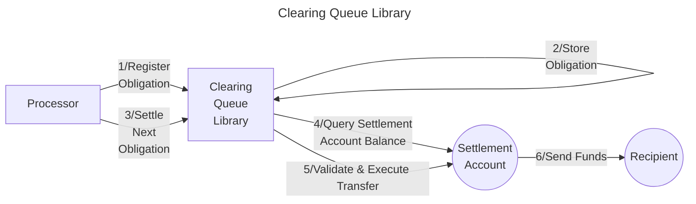

# Valence Clearing Queue Library

The **Valence Clearing Queue** library allows **registration and settlement of withdrawal obligations** in a FIFO (First-In-First-Out) manner. It maintains a queue of pending withdrawal obligations, with each obligation containing recipient information, payout amounts, and a unique identifier. When settling obligations, funds are pulled from a **settlement input account** and sent to the specified recipients.

The queue processes obligations based on a strict, monotonically increasing order of the obligation ids.
This is meant to prevent any out-of-order errors that may arise from latency or other issues.

## High-level flow



## Configuration

The library is configured on instantiation via the `LibraryConfig` type.

```rust
pub struct LibraryConfig {
    /// settlement input account which we tap into in order
    /// to settle the obligations
    pub settlement_acc_addr: LibraryAccountType,
    /// obligation base denom
    pub denom: String,
    /// latest registered obligation id.
    /// if `None`, defaults to 0
    pub latest_id: Option<Uint64>,
}
```

The `settlement_acc_addr` specifies the account from which funds will be pulled to fulfill settlement obligations. The library will check that this account has sufficient balance before attempting to settle each obligation.

Configured `denom` is the base clearing denomination which will be applied to all obligation amounts.

Lastly, the optional `latest_id` field allows to configure the library order to start from a specific id.
If `None`, latest id defaults to 0. Otherwise, it will start from the specified id.
