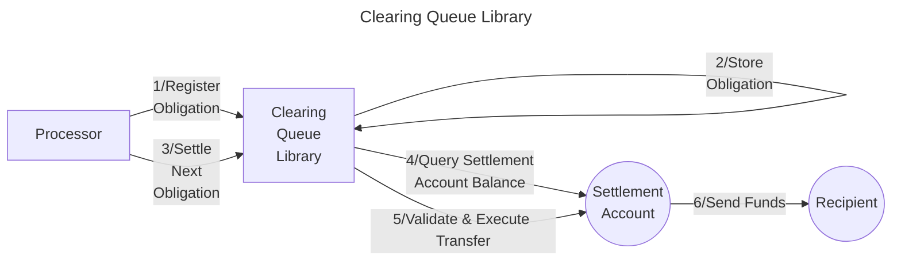

# Valence Clearing Queue Library

The **Valence Clearing Queue** library allows **registration and settlement of withdrawal obligations** in a FIFO (First-In-First-Out) manner. It maintains a queue of pending withdrawal obligations, with each obligation containing recipient information, payout amounts, and a unique identifier. When settling obligations, funds are pulled from a **settlement input account** and sent to the specified recipients.

## High-level flow



## Configuration

The library is configured on instantiation via the `LibraryConfig` type.

```rust
pub struct LibraryConfig {
    /// settlement input account which we tap into in order
    /// to settle the obligations
    pub settlement_acc_addr: LibraryAccountType,
}
```

The `settlement_acc_addr` specifies the account from which funds will be pulled to fulfill settlement obligations. The library will check that this account has sufficient balance before attempting to settle each obligation.
