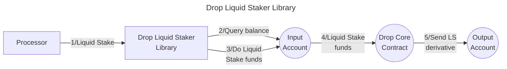

# Valence Drop Liquid Staker library

The **Valence Drop Liquid Staker** library allows to **liquid stake** an asset from an **input account** in the [Drop protocol](https://docs.drop.money/) and deposit the liquid staking derivate into the **output account**. It is typically used as part of a **Valence Program**. In that context, a **Processor** contract will be the main contract interacting with the Forwarder library.

## High-level flow



## Configuration

The library is configured on instantiation via the `LibraryConfig` type.

```rust
pub struct LibraryConfig {
    pub input_addr: LibraryAccountType,
    pub output_addr: LibraryAccountType,
    // Address of the liquid staker contract (drop core contract)
    pub liquid_staker_addr: String,
    // Denom of the asset we are going to liquid stake
    pub denom: String,
}
```
