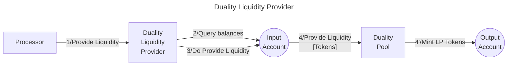

# Duality Lper library

The **Valence Duality LPer library** allows users to **provide liquidity** into a Duality Liquidity Pool from an **input account** and deposit the LP token into an **output account**.

## High-level flow



## Configuration

The library is configured on instantiation via the `LibraryConfig` type.

```rust
pub struct LibraryConfig {
    /// Address of the input account 
    pub input_addr: LibraryAccountType,
    /// Address of the output account 
    pub output_addr: LibraryAccountType,
    /// Configuration for the liquidity provider
    /// This includes the pool address and asset data
    pub lp_config: LiquidityProviderConfig,
}

pub struct LiquidityProviderConfig {
    /// Address of the pool we are going to provide liquidity for
    pub pool_addr: String,
    /// Denoms of both assets we are going to provide liquidity for
    pub asset_data: AssetData,
}
```
