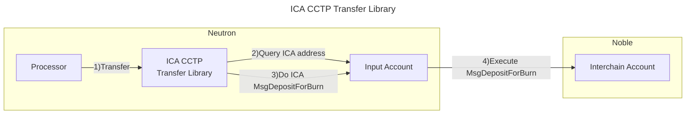

# Valence ICA CCTP Transfer Library

The **Valence ICA CCTP Transfer Library** library allows remotely executing a **CCTP transfer** using a **Valence interchain account** on [Noble Chain](https://www.noble.xyz/). It does that by remotely sending a **MsgDepositForBurn** to the ICA created by the **Valence interchain account** on Noble. It is typically used as part of a **Valence Program**. In that context, a **Processor** contract will be the main contract interacting with the **Valence ICA CCTP Transfer Library**.

## High-level flow



## Configuration

The library is configured on instantiation via the `LibraryConfig` type.

```rust
pub struct LibraryConfig {
    // Address of the input account (Valence interchain account)
    pub input_addr: LibraryAccountType,
    // Amount that is going to be transferred
    pub amount: Uint128,
    // Denom that is going to be transferred
    pub denom: String,
    // Destination domain id
    pub destination_domain_id: u32,
    // Address of the recipient account on the destination domain
    // This address is the bytes representation of the address (with 32 length and padded zeroes)
    // For more information, check https://docs.noble.xyz/cctp/mint#example
    pub mint_recipient: Binary,
}
```
