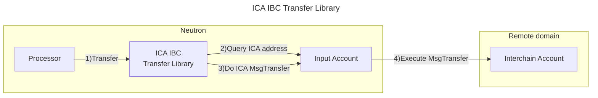

# Valence ICA IBC Transfer Library

The **Valence ICA IBC Transfer Library** library allows remotely executing an **IBC transfer** using a **Valence interchain account** on a remote IBC connected domain. It does that by remotely sending a **MsgTransfer** to the ICA created by the **Valence interchain account** on the remote domain. It is typically used as part of a **Valence Program**. In that context, a **Processor** contract will be the main contract interacting with the **Valence ICA IBC Transfer Library**.

## High-level flow



## Configuration

The library is configured on instantiation via the `LibraryConfig` type.

```rust
pub struct LibraryConfig {
    // Address of the input account (Valence interchain account)
    pub input_addr: LibraryAccountType,
    // Amount that is going to be transferred
    pub amount: Uint128,
    // Denom that is going to be transferred
    pub denom: String,
    // Receiver on the other chain
    pub receiver: String,
    // Memo to be passed in the IBC transfer message.
    pub memo: String,
    // Remote chain info
    pub remote_chain_info: RemoteChainInfo,
    // Denom map for the Packet-Forwarding Middleware, to perform a multi-hop transfer.
    pub denom_to_pfm_map: BTreeMap<String, PacketForwardMiddlewareConfig>,
}

pub struct RemoteChainInfo {
    // Channel ID to be used
    pub channel_id: String,
    // Timeout for the IBC transfer in seconds. If not specified, a default 600 seconds will be used will be used
    pub ibc_transfer_timeout: Option<u64>,
}

// Configuration for a multi-hop transfer using the Packet Forwarding Middleware
struct PacketForwardMiddlewareConfig {
  // Channel ID from the source chain to the intermediate chain
  local_to_hop_chain_channel_id: String,
  // Channel ID from the intermediate to the destination chain
  hop_to_destination_chain_channel_id: String,
  // Temporary receiver address on the intermediate chain
  hop_chain_receiver_address: String,
}
```
