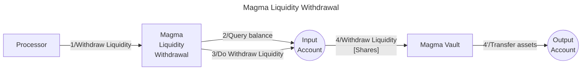

# Magma withdrawer library

The **Valence Magma Withdrawer library** allows users to **withdraw liquidity** from Magma Vault from an **input account** and receive the withdrawn tokens into an **output account**.

## High-level flow


## Configuration

The library is configured on instantiation via the `LibraryConfig` type.

```rust
pub struct LibraryConfig {
    // Address of the input account 
    pub input_addr: LibraryAccountType,
    // Address of the output account 
    pub output_addr: LibraryAccountType,
    // Address of the vault we are going to withdraw liquidity from 
    pub vault_addr: String,
}
```