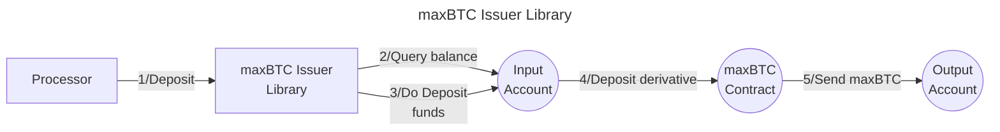

# Valence maxBTC Issuer Library

The **Valence maxBTC Issuer Library** library allows **depositing** a BTC derivative asset from an **input account** in the maxBTC issuer contract and deposit the resulting maxBTC into the **output account**. It is typically used as part of a **Valence Program**. In that context, a **Processor** contract will be the main contract interacting with this library.

## High-level flow



## Configuration

The library is configured on instantiation via the `LibraryConfig` type.

```rust
pub struct LibraryConfig {
    pub input_addr: LibraryAccountType,
    pub output_addr: LibraryAccountType,
    // Address of the maxBTC issuer contract
    pub maxbtc_issuer_addr: String,
    // Denom of the BTC derivative we are going to deposit
    pub btc_denom: String,
}
```
