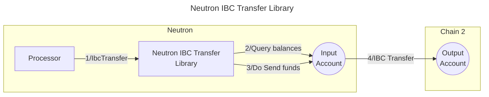

# Valence Neutron IBC Transfer library

The **Valence Neutron IBC Transfer** library allows to transfer funds over IBC from an **input account** on Neutron to an **output account** on a destination chain. It is typically used as part of a **Valence Program**. In that context, a **Processor** contract will be the main contract interacting with the Forwarder library.

Note: this library should not be used on another CosmWasm chain than Neutron, which requires some fees to be paid to relayers for IBC transfers. For other CosmWasm chains, prefer using the **Generic IBC Transfer library** instead.

## High-level flow



## Configuration

The library is configured on instantiation via the `LibraryConfig` type.

```rust
struct LibraryConfig {
  // Account from which the funds are pulled (on the source chain)
  input_addr: LibraryAccountType,
  // Account to which the funds are sent (on the destination chain)
  output_addr: LibraryAccountType,
  // Denom of the token to transfer
  denom: UncheckedDenom,
  // Amount to be transferred, either a fixed amount or the whole available balance.
  amount: IbcTransferAmount,
  // Memo to be passed in the IBC transfer message.
  memo: String,
  // Information about the destination chain.
  remote_chain_info: RemoteChainInfo,
  // Denom map for the Packet-Forwarding Middleware, to perform a multi-hop transfer.
  denom_to_pfm_map: BTreeMap<String, PacketForwardMiddlewareConfig>,
}

// Defines the amount to be transferred, either a fixed amount or the whole available balance.
enum IbcTransferAmount {
  // Transfer the full available balance of the input account.
  FullAmount,
  // Transfer the specified amount of tokens.
  FixedAmount(Uint128),
}

pub struct RemoteChainInfo {
  // Channel of the IBC connection to be used.
  channel_id: String,
  // Port of  the IBC connection to be used.
  port_id: Option<String>,
  // Timeout for the IBC transfer.
  ibc_transfer_timeout: Option<Uint64>,
}

// Configuration for a multi-hop transfer using the Packet Forwarding Middleware
struct PacketForwardMiddlewareConfig {
  // Channel ID from the source chain to the intermediate chain
  local_to_hop_chain_channel_id: String,
  // Channel ID from the intermediate to the destination chain
  hop_to_destination_chain_channel_id: String,
  // Temporary receiver address on the intermediate chain. Typically this is set to an invalid address so the entire transaction will revert if the forwarding fails. If not 
  // provided, will be set to "pfm"
  hop_chain_receiver_address: Option<String>,
}
```
