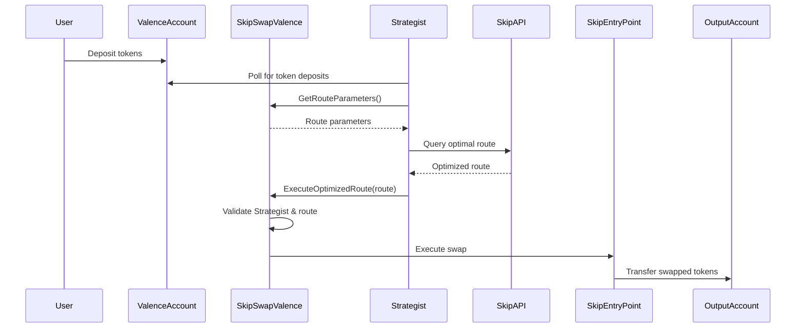

# Skip Swap Library Architecture

## 1. Overview

The Skip Swap Library facilitates token swaps through the Skip Protocol, focusing on cross-chain swaps and optimal routing. The library is designed to be integrated with the Valence Protocol and relies on an external Strategist actor to interact with the Skip API.

## 2. Project Structure

The project is organized into three main components:

1. **Skip Swap Valence** (`skip-swap-valence`): The core CosmWasm contract library
2. **Skip Swap Strategist** (`strategist`): A separate Rust crate for the off-chain component
3. **Integration Tests** (`integration-test`): Tests that verify the integration between the components

This separation allows for cleaner development and deployment, with the CosmWasm contract focusing on on-chain validation and execution, while the Strategist handles off-chain API interactions.

## 3. Components

### 3.1 Skip Swap Valence

The core CosmWasm contract that:
- Stores route configuration in state
- Validates routes returned by the Strategist
- Forwards valid swap messages to the Skip entry point

### 3.2 Strategist Actor (Independent Crate)

An off-chain process that:
- Runs as a standalone binary with its own configuration
- Polls the Valence input account for specific token deposits
- Reads route parameters from the library contract
- Queries the Skip API for optimal routes
- Submits route execution transactions back to the library

The Strategist is composed of several modules:
- `chain.rs`: Handles blockchain interactions
- `orchestrator.rs`: Coordinates the polling and route submission process
- `skip.rs`: Manages communication with the Skip API
- `types.rs`: Defines common data structures
- `msg.rs`: Defines message formats for communication with the library contract

### 3.3 Skip Entry Point

The Skip Protocol's entry point contract that executes the actual swaps across chains and DEXes.

## 4. Configuration Structure

The library maintains the following configuration in contract state:

```rust
pub struct Config {
    /// Address authorized to query Skip API and submit routes
    pub strategist_address: Addr,
    
    /// Skip entry point contract address
    pub skip_entry_point: Addr,
    
    /// Permitted asset pairs that can be swapped
    pub allowed_asset_pairs: Vec<AssetPair>,
    
    /// Permitted venues (DEXes) to use for swaps
    pub allowed_venues: Vec<String>,
    
    /// Maximum slippage allowed (in percentage points)
    pub max_slippage: Decimal,
    
    /// Destination accounts for specific token transfers
    pub token_destinations: HashMap<String, Addr>,
    
    /// Intermediate accounts for multi-hop routes
    pub intermediate_accounts: HashMap<String, Addr>,
}

pub struct AssetPair {
    pub input_asset: String,
    pub output_asset: String,
}
```

The configuration is provided during contract instantiation.

## 5. Function Messages

The contract exposes the following function messages:

### 5.1 `GetRouteParameters`

Called by the Strategist to obtain route constraints and parameters:

```rust
pub struct GetRouteParametersResponse {
    pub allowed_asset_pairs: Vec<AssetPair>,
    pub allowed_venues: Vec<String>,
    pub max_slippage: Decimal,
    pub intermediate_accounts: HashMap<String, Addr>,
    pub token_destinations: HashMap<String, Addr>,
}
```

### 5.2 `ExecuteOptimizedRoute`

Called by the Strategist with the route from Skip API:

```rust
pub struct ExecuteOptimizedRouteMsg {
    pub input_denom: String,
    pub input_amount: Uint128,
    pub output_denom: String,
    pub min_output_amount: Uint128,
    pub route: SkipRouteResponse,
}
```

## 6. Workflow

### 6.1 Configuration

1. The library is instantiated with a configuration specifying:
   - Strategist address
   - Skip entry point address
   - Allowed asset pairs
   - Allowed venues
   - Slippage parameters
   - Token destinations
   - Intermediate accounts for multi-hop routes

### 6.2 Strategist-Driven Swap Process



1. User deposits tokens to the Valence input account
2. Strategist polls the Valence input account for token deposits
3. When tokens are detected, Strategist calls `GetRouteParameters()`
4. Library provides route parameters including allowed asset pairs, venues, etc.
5. Strategist queries Skip API with these parameters to find optimal route
6. Strategist calls `ExecuteOptimizedRoute()` with the optimized route
7. Library validates:
   - Strategist's identity
   - Route adheres to allowed asset pairs
   - Route uses allowed venues
   - Slippage is within limits
8. If validation passes, library constructs and executes Skip message
9. Skip performs the swap and sends tokens to output account

## 7. Security Considerations

### 7.1 Strategist Identity Validation

Only the designated Strategist address can submit routes. This is critical as the Strategist has the authority to initiate swaps.

### 7.2 Route Validation

All routes returned by the Strategist are validated against the parameters specified in the configuration:
- Input and output tokens must be in the allowed asset pairs
- Venues must be in the allowed venues list
- Slippage must be within defined limits

### 7.3 Funds Management

- The library never holds funds directly; it only authorizes swaps
- Funds flow from the Valence input account to the Skip entry point and then to the destination
- For multi-hop routes, intermediate accounts are specified in the configuration

## 8. Error Handling

The library implements comprehensive error handling:
- Invalid Strategist address
- Disallowed asset pairs
- Disallowed venues
- Excessive slippage
- Timeout issues
- Response validation failures

## 9. Testing Strategy

### 9.1 Unit Tests

- Test route validation against configuration
- Test error handling
- Test message construction

### 9.2 Integration Tests

- Mock Strategist interactions
- Test end-to-end workflow with a mock Skip entry point
- Validate proper funds flow

### 9.3 Static Route Tests

- Test with pre-defined static routes
- Validate specific swap paths (e.g., USDC to stETH via Astroport)

## 10. Skip API Integration

The Strategist actor interacts with the Skip API, specifically:

### 10.1 Route Planning Endpoints

- `POST /v2/fungible/route`: Find optimal routes between tokens

### 10.2 Chain Information Endpoints

- `GET /v2/info/chains`: Get information about supported chains
- `GET /v2/info/bridges`: Get information about supported bridges
- `GET /v2/fungible/assets`: Get information about supported assets

### 10.3 Transaction Generation

- `POST /v2/fungible/msgs`: Generate messages for execution

### 10.4 API Parameter Mapping

The library's configuration parameters map to Skip API parameters:
- `allowed_asset_pairs` → `source_asset_denom`/`source_asset_chain_id` and `dest_asset_denom`/`dest_asset_chain_id`
- `allowed_venues` → `allowed_bridges` and `allowed_routes`
- `max_slippage` → `slippage_tolerance_percent`

## 11. Future Extensions

- Support for multiple Strategists with different permissions
- Dynamic adjustment of slippage based on market conditions
- Rate limiting for route requests
- Support for more complex multi-hop routes 