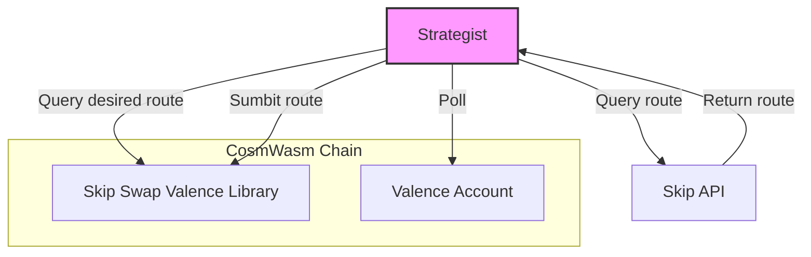

# Skip Swap Valence Strategist Architecture

The Skip Swap Valence Strategist is a separate service component that automates the process of finding and executing optimal swap routes through the Skip API. This document outlines the architecture of the strategist and its interactions with other components.

## Architecture Overview

The strategist operates as an off-chain service that continuously monitors market conditions and executes optimized swap routes when favorable opportunities are detected. It interfaces with both the Skip API for route discovery and the Skip Swap Valence library contract for route execution.

## Component Interactions

### Skip API
- The strategist queries the Skip API to discover optimal swap routes
- Receives information on potential routes including expected output, slippage, and venues
- Uses the route information to make informed decisions on swap execution

### Skip Swap Valence Library Contract
- The strategist submits optimized routes to the library contract for execution
- Receives execution results and updates its state accordingly
- Monitors successful and failed transactions to refine its strategy

### Valence Account Contract
- The library contract forwards the execution to the Valence Account Contract
- The account contract holds and manages the assets being swapped
- Permissions and role-based access are managed at this level

## Core Components

1. **Configuration Manager**
   - Manages API endpoints, contract addresses, and strategy parameters
   - Stores authentication information for the Skip API
   - Configures monitoring intervals and thresholds

2. **Route Optimizer**
   - Evaluates multiple potential routes from the Skip API
   - Compares expected outputs, slippage, and gas costs
   - Selects the most profitable route for execution

3. **Market Monitor**
   - Continuously watches for favorable market conditions
   - Triggers route optimization when opportunities are detected
   - Tracks historical prices and volumes to inform decisions

4. **Chain Client**
   - Handles on-chain interactions through CosmWasm interfaces
   - Manages transaction signing and broadcasting
   - Monitors transaction status and handles retries

5. **Skip API Client**
   - Encapsulates the Skip API interaction logic
   - Handles rate limiting and error handling
   - Formats requests and parses responses

## Operational Flow

1. The Market Monitor continuously analyzes market conditions
2. When a potentially profitable opportunity is detected, the Route Optimizer is triggered
3. The Route Optimizer queries the Skip API for potential routes
4. The optimal route is selected based on expected output and cost
5. The strategist submits the chosen route to the Skip Swap Valence Library Contract
6. The library contract validates and forwards the execution to the Valence Account Contract
7. Results are monitored and used to refine future strategy decisions

## Deployment Considerations

- The strategist requires a secure environment with reliable connectivity
- Private keys for transaction signing must be securely managed
- Monitoring and alerting systems should be in place for rapid intervention
- Resource scaling should accommodate varying market activity levels

## Security Considerations

- API keys and private keys should be stored securely
- Request rate limiting should be implemented to avoid API abuse
- Transaction validation should occur before submission
- Error handling and logging are essential for identifying issues
- Failover mechanisms should be in place for critical components 