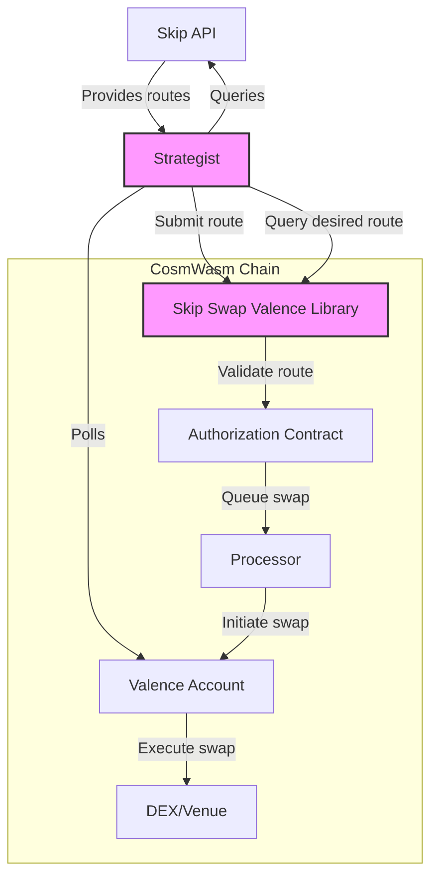

# Skip Swap Valence Library Architecture

The skip-swap-valence library is a core component in the Valence Protocol ecosystem that facilitates optimized swap routes using the Skip API. This document outlines the architecture of the library and its interactions with other Valence system components.

## Architecture Overview

The library is designed as a CosmWasm smart contract that serves as an intermediary between the Valence system and Skip Protocol's swap functionality. It provides a standard interface for executing optimized swap routes across various venues (DEXes) while maintaining the security and validation requirements of the Valence Protocol.

## Component Interactions

### Authorization Contract
- The Skip Swap Valence library verifies each operation with the Authorization Contract
- Ensures that only authorized strategists can execute swap operations
- Validates asset pairs and venue restrictions to maintain compliance with platform policies

### Processor
- Once authorized, the library interacts with the Processor to execute swap operations
- The Processor handles the actual interactions with external DEXes and venues
- Handles token transfers between intermediate accounts as needed for multi-hop swaps

### Skip API
- The Strategist queries the Skip API to find the optimal swap routes
- Receives route information that includes operations, venues, and expected output
- Routes are validated against configured parameters before execution by the library

### Strategist
- Monitors Valence accounts for deposits requiring swaps
- Queries the Skip API for optimal routes
- Submits optimized routes to the Skip Swap Valence library
- Acts as the off-chain component that bridges the Valence ecosystem with the Skip API

## Core Components

1. **Configuration Manager**
   - Stores and manages strategist addresses, allowed asset pairs, and venues
   - Handles configuration updates and validation
   - Maintains token destination addresses and intermediate accounts

2. **Validation Module**
   - Validates swap routes against configuration
   - Ensures slippage is within acceptable limits
   - Verifies venue and asset pair authorization

3. **Route Execution Engine**
   - Handles the execution of optimized routes
   - Manages timeout constraints
   - Records route execution history 

4. **Query Interface**
   - Provides methods to simulate swaps
   - Exposes configuration data for strategists
   - Allows querying of route parameters for specific tokens

## Data Flow

1. A Strategist submits an optimized route to the Skip Swap Valence library
2. The library validates the route against its configuration
3. Authorization checks are performed with the Authorization Contract
4. If authorized, the route is passed to the Processor for execution
5. The Processor interacts with the appropriate DEXes/venues
6. Results are returned to the Strategist

## Security Considerations

- Only authorized strategists can execute swap operations
- Asset pairs and venues are carefully validated
- Slippage parameters are enforced to protect against price manipulation
- Timeouts are implemented to prevent stale trades 