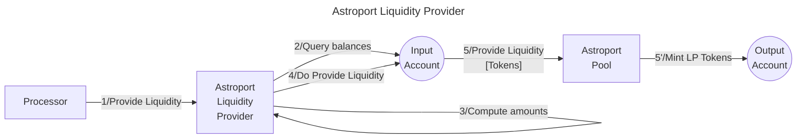

# Astroport LPer service

The **Valence Astroport LPer service** service allows to **provide liquidity** into an Astroport Liquidity Pool from an **input account** an deposit the LP token into an **output account**.

## High-level flow



## Configuration

The service is configured on instantiation via the `ServiceConfig` type.

```rust
pub struct ServiceConfig {
    // Account from which the funds are LPed
    pub input_addr: String,
    // Account to which the LP tokens are forwarded
    pub output_addr: String,
    // Pool address
    pub pool_addr: String,
    // LP configuration
    pub lp_config: LiquidityProviderConfig,
}

pub struct LiquidityProviderConfig {
    // LP token type, old Astroport pools use Cw20 lp tokens and new pools use native tokens, so we specify here what kind of token we are going to get.
    // Also useful to know which version of Astroport we are going to interact with
    pub lp_token_type: LpTokenType,
    // Denoms of both native assets we are going to provide liquidity for
    pub asset_data: AssetData,
    // Amounts of both tokens we consider ok to single-side lp
    pub single_side_lp_limits: SingleSideLpLimits,
    // Slippage tolerance parameter for liquidity provisioning
    pub slippage_tolerance: Option<Decimal>,
    // Config for the pool price expectations upon instantiation
    pub pool_price_config: PoolPriceConfig,
}

pub enum LpTokenType {
    Native,
    Cw20,
}

pub struct AssetData {
    pub asset1: String,
    pub asset2: String,
}

pub struct SingleSideLpLimits {
    pub asset1_limit: Uint128,
    pub asset2_limit: Uint128,
}

pub struct PoolPriceConfig {
    pub expected_spot_price: Decimal,
    pub acceptable_price_spread: Decimal,
}
```
