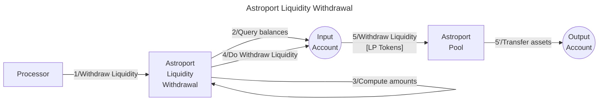

# Astroport Withdrawer service

The **Valence Astroport Withdrawer service** service allows to **withdraw liquidity** from an Astroport Liquidity Pool from an **input account** an deposit the withdrawed tokens into an **output account**.

## High-level flow



## Configuration

The service is configured on instantiation via the `ServiceConfig` type.

```rust
pub struct ServiceConfig {
    // Account from which the funds are LPed
    pub input_addr: String,
    // Account to which the LP tokens are forwarded
    pub output_addr: String,
    // Pool address
    pub pool_addr: String,
    // Liquidity withdrawer configuration
    pub withdrawer_config: LiquidityWithdrawerConfig,
}

pub struct LiquidityWithdrawerConfig {
    // Pool type, old Astroport pools use Cw20 lp tokens and new pools use native tokens, so we specify here what kind of token we are will use.
    // We also provide the PairType structure of the right Astroport version that we are going to use for each scenario
    pub pool_type: PoolType,
}

pub enum PoolType {
    NativeLpToken(astroport::factory::PairType),
    Cw20LpToken(astroport_cw20_lp_token::factory::PairType),
}
```
