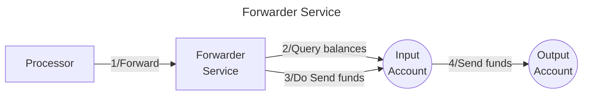

# Valence Forwarder service

The **Valence Forwarder** service allows to **continuously forward funds** from an **input account** to an **output account**, following some time **constraints**. It is typically used as part of a **Valence Workflow**, 

## High-level flow



## Configuration

The service is configured on instantiation via the `ServiceConfig` type.
```rust
pub struct ServiceConfig {
    // Account from which the funds are pulled
    pub input_addr: String,
    // Account to which the funds are sent
    pub output_addr: String,
    // Forwarding configuration per denom
    pub forwarding_configs: Vec<UncheckedForwardingConfig>,
    // Constraints on forwarding operations
    pub forwarding_constraints: ForwardingConstraints,
}

pub struct UncheckedForwardingConfig {
    // Unverified denom (either native or CW20)
    pub denom: UncheckedDenom,
    // Max amount of tokens to be transferred per Forward operation
    pub max_amount: Uint128,
}

// Time constraints on forwarding operations
pub struct ForwardingConstraints {
    // Minimum interval between 2 successive forward operations,
    // specified either as a number of blocks, or as a time delta.
    min_interval: Option<Duration>,
}
```
