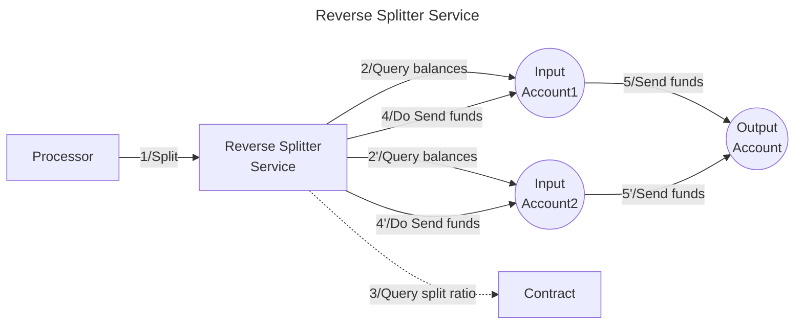

# Valence Reverse Splitter service

The **Reverse Splitter** service allows to **route funds** from **one or more input account(s)** to a **single output account**, for **one or more token denom(s)** according to the configured **ratio(s)**. It is typically used as part of a **Valence Workflow**. In that context, a **Processor** contract will be the main contract interacting with the Forwarder service.

## High-level flow



## Configuration

The service is configured on instantiation via the `ServiceConfig` type.
```rust
struct ServiceConfig {
    output_addr: ServiceAccountType,   // Account to which the funds are sent.
    splits: Vec<UncheckedSplitConfig>, // Split configuration per denom.
    base_denom: UncheckedDenom         // Base denom, used with ratios.
}

// Split config for specified account
struct UncheckedSplitConfig {
  denom: UncheckedDenom,                // Denom for this split configuration (either native or CW20).
  account: ServiceAccountType,          // Address of the input account for this split config.
  amount: Option<Uint128>,              // Fixed amount of tokens.
  ratio: Option<UncheckedRatioConfig>,  // Amount defined based on a ratio.
  factor: Option<u64>                   // Multiplier relative to other denoms (only used if a ratio is specified).
}

// Ratio configuration, either fixed & dynamically calculated
enum UncheckedRatioConfig {
  FixedRatio(Decimal),  // Fixed ratio e.g. 0.0262 for NTRN/STARS (or could be another arbitrary ratio)
  DynamicRatio {        // Dynamic ratio calculation (delegated to external contract)
	contract_addr: "<TWAP Oracle wrapper contract address>",
    params: "base64-encoded arbitrary payload to send in addition to the denoms"
  }
}

// Standard query & response for contract computing a dynamic ratio
// for the Splitter & Reverse Splitter services.
#[cw_serde]
#[derive(QueryResponses)]
pub enum DynamicRatioQueryMsg {
    #[returns(DynamicRatioResponse)]
    DynamicRatio {
        denoms: Vec<String>,
        params: String,
    }
}

#[cw_serde]
// Response returned by the external contract for a dynamic ratio
struct DynamicRatioResponse {
    pub denom_ratios: HashMap<String, Decimal>,
}
```
