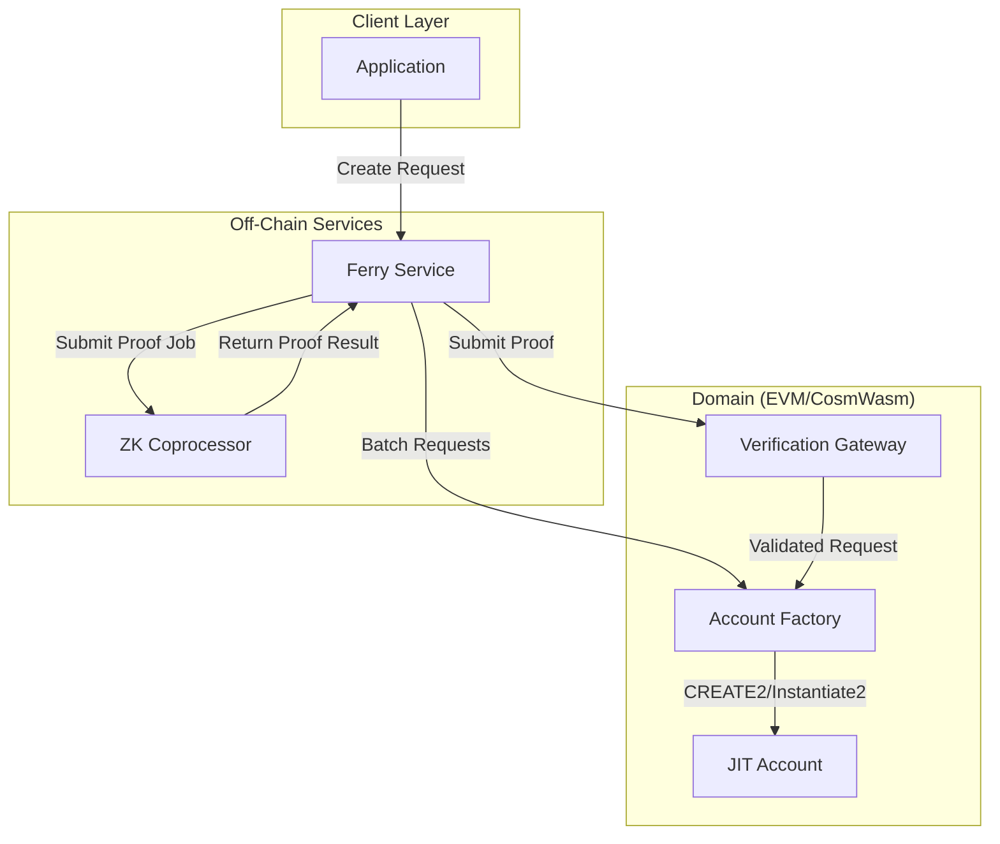

# Account Factory System

## Core Problem

Autonomous programs operating with public information need the ability to generate ad hoc addresses during runtime. However, these programs cannot execute address generation directly due to efficiency and cost constraints - off-chain actors must perform this work. This creates a fundamental trust problem:

**Problem:**
- **Autonomous Programs** require deterministic account creation during execution
- **Public Information** means all program state and logic is observable by potential attackers
- **Off-Chain Execution** is necessary for efficiency, but these actors must be assumed untrusted
- **Address Control Risk** exists where malicious actors could manipulate the generation process to create accounts they control

**Attack Scenarios Without Proper Constraints:**
1. **Front-Running**: Attackers observe program execution and generate accounts with predictable addresses before the legitimate transaction
2. **Input Manipulation**: Malicious off-chain actors modify entropy sources or parameters to influence address generation
3. **Controller Substitution**: Attackers replace intended controllers with addresses they control
4. **Replay Attacks**: Reusing previous requests to create unintended duplicate accounts

**Solution:**
The Account Factory System constrains address generation through cryptographic entropy binding and deterministic addressing, ensuring that:
- Off-chain actors cannot predict or control generated addresses
- Historical entropy prevents front-running attacks
- ZK proofs guarantee correct salt generation without revealing entropy sources
- Account request IDs prevent replay attacks
- Controller binding ensures only intended parties control created accounts

This enables autonomous programs to securely delegate account creation to untrusted off-chain actors while maintaining full control over the addressing process.

## Overview

The Valence Account Factory System provides efficient, deterministic deployment of cross-chain accounts using factory patterns. It supports both EVM (CREATE2-based clones) and CosmWasm (Instantiate2) environments with optional ZK coprocessor validation.

**Key Features:**
- **Deterministic Addressing**: Compute account addresses before creation
- **Atomic Operations**: Single-transaction account creation with validation
- **Unified Capabilities**: All accounts support both token custody and data storage
- **Batch Processing**: Ferry services for efficient multi-account creation
- **Cross-Chain Consistency**: Uniform behavior across blockchain environments

## System Architecture



### Core Components

1. **Account Factory Contracts**: Handle deterministic account creation with entropy-based salt generation and account request ID management
2. **JIT Account Contracts**: Lightweight accounts with controller-bound execution and library approval systems
3. **Ferry Services**: Off-chain operators providing batch processing for efficient multi-account creation
4. **ZK Coprocessor Integration**: Validates account creation by binding deterministic salt to account derivation

## Account Capabilities

All accounts created by the factory have unified capabilities, supporting both:

- **Token Custody**: Can hold, transfer, and manage fungible tokens
- **Data Storage**: Can store and manage non-fungible data objects

This unified approach simplifies the system architecture while providing full functionality for all use cases. Accounts can simultaneously manage tokens and store application-specific data without requiring different account types.

## Factory Creation

The factory system provides deterministic addressing using CREATE2/Instantiate2, enabling address computation before creation. This supports cross-chain coordination and atomic operations with comprehensive validation including signature verification, replay protection, and fee validation.

Key benefits:
- **Predictable Addresses**: Compute before creation for planning
- **Atomic Guarantees**: All-or-nothing semantics with rollback
- **Request Validation**: Comprehensive checks prevent replay attacks
- **Batch Support**: Efficient multi-account creation

## Salt Generation and Security

### Security Model

Salt generation prevents front-running by combining multiple entropy sources:

- **Temporal Entropy**: Block-based data (timestamps, heights) that changes frequently
- **Request-Specific Data**: User parameters that attackers cannot predict
- **Multi-Source Combination**: Prevents control of all inputs

The system ensures that by the time attackers observe entropy and attempt address computation, temporal components have changed, invalidating pre-computed addresses.

### Salt Algorithm

```text
salt = hash(controller + libraries_hash + program_id + account_request_id + block_entropy)
```

This provides:
- **Deterministic**: Identical inputs produce identical outputs
- **Unique**: Each request generates a unique salt
- **Secure**: Incorporates unpredictable temporal data
- **Cross-Chain Consistent**: Same algorithm across all domains

## Historical Block Entropy Architecture

### Third-Party Execution Model

The Account Factory is designed for real-world execution where third-party actors (strategists, relayers, program executors) advance Valence programs and trigger account creation, rather than end users directly submitting transactions.

**Execution Flow:**
1. **Program Execution**: Valence programs determine when account creation is needed
2. **Actor Coordination**: Off-chain actors build account creation requests using recent historical blocks
3. **Ferry Processing**: Ferry services coordinate ZK proof generation and submission
4. **On-Chain Validation**: Contracts validate historical block age and create accounts

### Temporal Validation

To prevent abuse while allowing off-chain coordination, contracts enforce temporal constraints on historical block usage:

```solidity
// EVM Implementation
uint256 public constant MAX_BLOCK_AGE = 200;

function createAccount(
    address controller,
    string memory programId,
    uint64 accountRequestId,
    uint256 historicalBlockNumber  // Must be recent
) external returns (address) {
    // Validate block age
    require(
        block.number - historicalBlockNumber <= MAX_BLOCK_AGE,
        "Historical block too old"
    );
    
    // Use historical entropy for salt generation
    bytes32 historicalEntropy = blockhash(historicalBlockNumber);
    bytes32 salt = keccak256(abi.encodePacked(
        controller, programId, accountRequestId,
        historicalEntropy, historicalBlockNumber
    ));
    
    // Create account with deterministic addressing
    // ...
}
```

```rust
// CosmWasm Implementation
pub const MAX_BLOCK_AGE: u64 = 200;

fn validate_request(
    deps: &DepsMut, 
    env: &Env, 
    request: &AccountRequest
) -> Result<(), ContractError> {
    // Check historical block is recent enough
    if env.block.height > request.historical_block_height + MAX_BLOCK_AGE {
        return Err(ContractError::HistoricalBlockTooOld {
            current_height: env.block.height,
            historical_height: request.historical_block_height,
        });
    }
    // ...
}
```

### Security Properties

**Why 200 blocks works:**
- **Finality Guarantee**: Blocks are definitively finalized (no reorg risk)
- **Proof Generation Time**: ~40 minutes on Ethereum allows for ZK proof generation
- **Attack Prevention**: Prevents use of very old entropy that might be compromised
- **Chain Compatibility**: Within `blockhash()` availability on most EVM chains

**Attack Mitigation:**
- **Replay Protection**: Account request IDs prevent duplicate account creation
- **Entropy Freshness**: Recent block requirement prevents long-term precomputation attacks
- **Program-Level Authorization**: Account factory does not control authorization, programs do
- **Temporal Bounds**: Historical block age limits prevent stale entropy usage

## ZK Coprocessor Integration

The Account Factory integrates with the Valence ZK System for salt generation integrity, providing the core security property that prevents front-running attacks.

### Security Model

**ZK Circuit Proves Salt Integrity → Smart Contract Uses Proven Salt for Address Generation**

The security comes from **separation of concerns**:
- **ZK Circuit**: Proves "this salt was computed correctly from these entropy sources"  
- **Smart Contract**: Uses that proven salt to deterministically compute and deploy the address

### Circuit Scope

**What's IN the circuit (cryptographically proven):**
- **Salt Generation Integrity**: Proving the salt was correctly computed from specified entropy sources
- **Entropy Binding**: Ensuring salt generation uses intended inputs (block data, program_id, account_request_id, libraries)

**What's ON-CHAIN (validated by smart contract using proven salt):**
- Address computation with CREATE2/Instantiate2 using **proven salt**
- Controller address validation (format checking)
- Library validation (address format and non-empty checks)
- Historical block age verification
- ZK proof verification

### Circuit Interface

```rust
// ZK Circuit Input (private)
pub struct CircuitInput {
    pub block_hash: [u8; 32],           // Or block_height for CosmWasm
    pub program_id: String,
    pub account_request_id: u64,
    pub libraries_hash: [u8; 32],       // Hash of approved libraries
}

// ZK Circuit Output (public)
pub struct CircuitOutput {
    pub salt: [u8; 32],                 // Proven salt
    pub is_valid: bool,                 // Always true for valid inputs
}
```

### Security Properties

**Why this prevents manipulation:**
- Off-chain actors can only generate valid proofs for correctly computed salts
- Smart contracts deterministically compute addresses using **proven salts**
- Historical block validation prevents stale entropy usage
- ZK proofs are cryptographically bound to specific entropy sources

### Integration Flow

1. **Off-chain**: ZK circuit generates proof of correct salt generation from entropy
2. **On-chain**: Smart contract verifies proof and uses **proven salt** for address computation  
3. **Deployment**: CREATE2/Instantiate2 guarantees address matches the proven salt

This ensures both **efficiency** (cheap on-chain address computation) and **security** (cryptographically proven salt generation).

## Implementation Examples

### Simple Account Creation

```rust
let request = AccountRequest {
    controller: "cosmos1...",
    libraries: vec!["library1", "library2"],
    program_id: "my_defi_app",
    account_request_id: 12345,
    historical_block_height: 98765,
    signature: None,
};

// Compute address before creation
let address = factory.compute_address(&request)?;

// Create account (with full token custody and data storage capabilities)
factory.create_account(request)?;
```

### Batch Processing

```rust
let batch = BatchRequest {
    requests: vec![request1, request2, request3],
    ferry: "ferry_operator",
    fee_amount: 1000,
};

ferry_service.create_accounts_batch(batch)?;
```

## Atomic Operations

All account creation operations are atomic - they either complete successfully or roll back completely. This includes:

- **Single Account**: Create with validation in one transaction
- **Batch Operations**: All accounts created or none
- **Comprehensive Validation**: Check all conditions before state changes
- **Automatic Rollback**: Undo partial changes on failure

## Ferry Services

Ferry operators provide batch processing optimization:

- **Cost Reduction**: Economies of scale for multiple accounts
- **Reliability**: Monitoring and retry logic
- **Fee Structures**: Competitive pricing with batch discounts
- **Status Tracking**: Progress updates and notifications

## Best Practices

### Security
- Use unique account request IDs per controller
- Include application-specific data in request hashes
- Verify controller permissions before creation
- Implement signature verification for sensitive operations

### Performance
- Use batch operations for multiple accounts
- Estimate gas requirements before execution
- Cache frequently computed values
- Leverage deterministic addressing for coordination

### Error Handling
- Check for account request ID collisions
- Validate address prediction matches creation
- Implement retry logic for ferry service failures
- Handle gas estimation errors gracefully

## Conclusion

The Valence Account Factory System provides secure, efficient cross-chain account creation with deterministic addressing and atomic guarantees. Key advantages include predictable addresses for off-chain coordination, unified account capabilities supporting both token custody and data storage, atomic operations with comprehensive validation, and cost-effective batch processing through ferry services. 