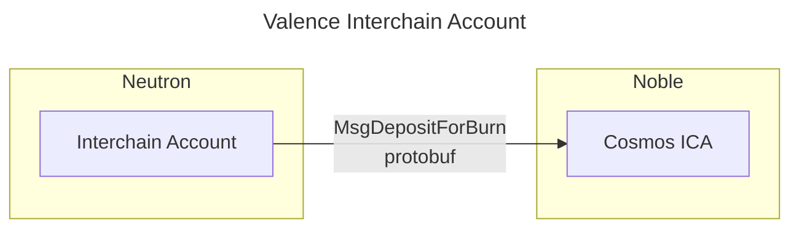

# Interchain Accounts

A **Valence Interchain Account** is a contract that creates a [Cosmos Interchain Account](https://ibc.cosmos.network/v8/apps/interchain-accounts/overview/) over IBC on a different domain. It will then send protobuf messages to the ICA over IBC for them to be executed remotely. It's specifically designed to interact with other chains in the Cosmos ecosystem, and more in particular with chains that don't support Smart Contracts.

**Valence Interchain Accounts** are created (i.e., instantiated) on **Neutron** and bound to a specific **Valence Program**. **Valence Programs** will typically use these accounts to trigger remote execution of messages on other domains.

As a simple example, consider a **Valence Program** that needs to bridge USDC from Cosmos to Ethereum using Noble Chain. Noble doesn't support CosmWasm or any other Execution Environment, so the **Valence Program** will use a **Valence Interchain Account** to first, create an ICA on Noble, and then send a message to the ICA to interact with the corresponding native module on Noble with the funds previously sent to the ICA.

For this, the program will create a **Valence Interchain Account** on the **Neutron domain** to create an ICA on the **Noble domain**:



**Valence Interchain Accounts** do not perform any operation by themselves, the operations are performed by **[Valence Libraries](../components/libraries_and_functions.md)**.

## API

### Instantiation

**Valence Interchain Accounts** are instantiated with the following message:

```rust
pub struct InstantiateMsg {
    pub admin: String, // Initial owner of the contract
    pub approved_libraries: Vec<String>,
    pub remote_domain_information: RemoteDomainInfo, // Remote domain information required to register the ICA and send messages to it
}

pub struct RemoteDomainInfo {
    pub connection_id: String,
    pub ica_timeout: Uint64,
}
```

In this message, the `connection_id` of the remote domain and the timeout for the ICA messages are specified.

### Execute Methods

```rust
pub enum ExecuteMsg {
    ApproveLibrary { library: String }, // Add library to approved list (only admin)
    RemoveLibrary { library: String },  // Remove library from approved list (only admin)
    ExecuteIcaMsg { msgs: Vec<ProtobufAny> }, // Execute a protobuf message on the ICA
    RegisterIca {},                     // Register the ICA on the remote chain
}
```

Library approval and removal follow the same implementation as that of the fund accounts.

`ExecuteIcaMsg` is a list of protobuf messages that will be sent to the ICA on the remote chain. Each message contains
the `type_url` and the protobuf encoded bytes to be delivered.

`RegisterIca` is a permissionless call that will register the ICA on the remote chain. This call requires the
**Valence Interchain Account** to not have another ICA created and open on the remote chain.

### Query Methods

Interchain account exposes the following `QueryMsg`:

```rust
pub enum QueryMsg {
    #[returns(Vec<String>)]
    ListApprovedLibraries {}, // Get list of approved libraries
    #[returns(IcaState)]
    IcaState {}, // Get the state of the ICA
    #[returns(RemoteDomainInfo)]
    RemoteDomainInfo {}, // Get the remote domain information
}

pub enum IcaState {
    NotCreated, // Not created yet
    Closed,     // Was created but closed, so creation should be retriggered
    InProgress, // Creation is in progress, waiting for confirmation
    Created(IcaInformation),
}

pub struct IcaInformation {
    pub address: String,
    pub port_id: String,
    pub controller_connection_id: String,
}
```

There are two specific queries for the **Valence Interchain Account**. The first one is `IcaState` which returns the state of the ICA. The second one is `RemoteDomainInfo` which returns the remote domain information that was provided during instantiation.
ICAs can only be registered if the `IcaState` is `NotCreated` or `Closed`.
