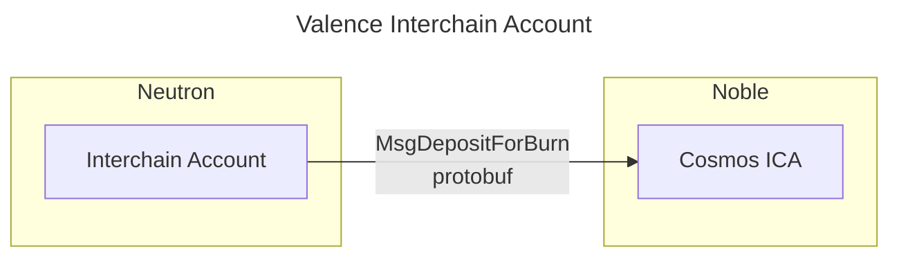

# Interchain Accounts

A **Valence Interchain Account** is a contract that creates a [Cosmos Interchain Account](https://ibc.cosmos.network/v8/apps/interchain-accounts/overview/) over IBC on a different domain. It will then send protobuf messages to the ICA over IBC for them to be executed remotely. It's specifically designed to interact with other chains in the Cosmos ecosystem, and more in particular with chains that don't support Smart Contracts.

**Valence Interchain Accounts** are created (i.e., instantiated) on **Neutron** and bound to a specific **Valence Program**. **Valence Programs** will typically use these accounts to trigger remote execution of messages on other domains.

As a simple example, consider a **Valence Program** that needs to bridge USDC from Cosmos to Ethereum using Noble Chain. Noble doesn't support CosmWasm or any other Execution Environment, so the **Valence Program** will use a **Valence Interchain Account** to first, create an ICA on Noble, and then send a message to the ICA to interact with the corresponding native module on Noble with the funds previously sent to the ICA.

For this, the program will create a **Valence Interchain Account** on the **Neutron domain** to create an ICA on the **Noble domain**:

**Valence Interchain Accounts** do not perform any operation by themselves, the operations are performed by **[Valence Libraries](../components/libraries_and_functions.md)**.
