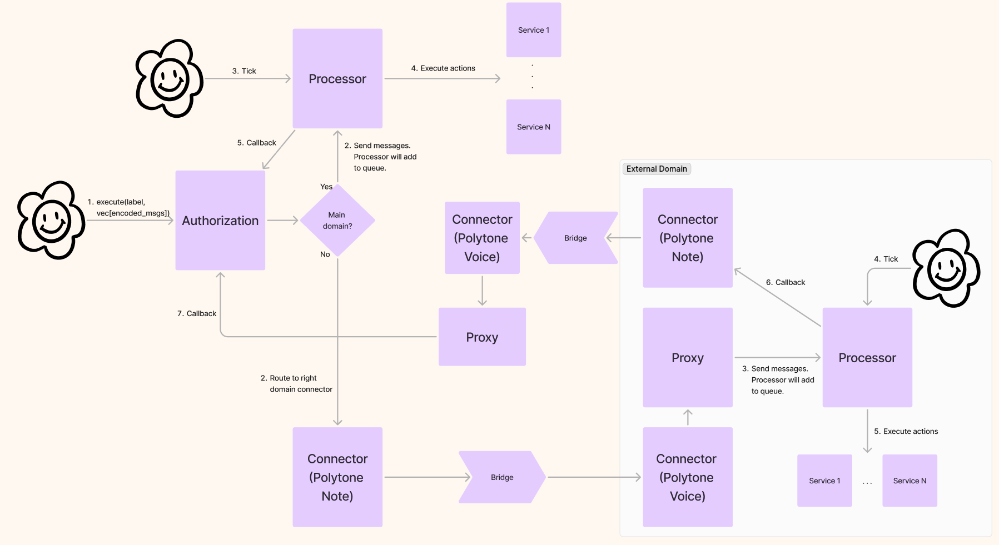

# User Actions

- `send_msgs(label, vec[ProcessorMessage])`: users can run an authorization with a specific label. If the authorization is `Permissioned`, the authorization contract will check if they are allowed to execute it by checking that the user has the token in its wallet if it's `Permissioned (without limit)` or that the user sent the token along with the messages if it's `Permissioned (with limit)`. Along with the authorization label, the user will provide an array of encoded messages, together with the message type (e.g. `CosmwasmExecuteMsg`, `EvmCall`...) and any other parameters for that specific ProcessorMessage (e.g. for a `CosmwasmMigrateMsg` we need to also pass a code_id). The contract will then check that the messages match the ones defined in the authorization (and in the correct order) and that all Parameters restrictions, if applied, are correct.

  If all checks are correct, the contract will route the messages to the correct `Processor` with an `execution_id` for the processor to callback with. This `execution_id` is unique for the entire application.
  If the execution of all the actions are confirmed via a callback, we will burn the token and if they fail, we will send the token back.
  Here is an example flowchart of how a user interacts with the authorization contract to execute functions on an external CosmWasm domain that is connected to the main domain with Polytone:

