# Connectors

Connectors are a way for the Authorization contract in the main domain to interact with external domains. When adding an `ExternalDomain` to the Authorization contract, depending on the `ExecutionEnvironment` we must specify the Connector information to be used. These connectors are responsible for receiving the message batches from the Authorization contract and trigger the necessary actions for the relayers to pick them up and deliver them to the Processor contract in the `ExternalDomain`. The connector on the `ExternalDomain` will also receive callbacks with the `ExecutionResult` from the Processor contract and send them back to the Authorization contract.

We currently support the following connectors:

### Polytone

To connect `ExternalDomains` that use `CosmWasm` as `ExecutionEnvironment` we use [Polytone](https://github.com/DA0-DA0/polytone). Polytone is a set of smart contracts that are instantiated on both domains that implement logic to pass messages to each other using IBC. Polytone consists of the following contracts:
- Polytone Note: contract responsible of sending the messages from the Authorization contract to the Processor contract on the external domain and receiving the callback from the Processor contract on the external domain and sending it back to the Authorization contract.
- Polytone Voice: contract that receives the message from Polytone Note and instantiates a Polytone Proxy for each sender that will redirect the message to the destination.
- Polytone Proxy: contract instantiated by Polytone Voice responsible for sending messages received from Polytone Note to the corresponding contract.

To connect the Authorization contract with an external domain that uses Polytone as a connector, we need to provide the Polytone Note address and the predicted Polytone Proxy addresses for both the Authorization contract (when adding the domain) and the Processor Contract (when instantiating the Processor). An IBC relayer must relay these two channels to enable communication.

This is the sequence of messages when using Polytone as a connector:

```mermaid
graph TD
  %% Execution Result Sequence
  subgraph Execution_Sequence [Execution Result Sequence]
    E2[Processor Contract]
    D2[Polytone Note on
    External Domain]
    C2[Polytone Voice on
    Main Domain]
    B2[Polytone Proxy on
    Main Domain]
    A2[Authorization Contract]
    
    E2 -->|Step 5: Execution Result| D2
    D2 -->|Step 6: Relayer| C2
    C2 -->|Step 7: Instantiate & Forward Result| B2
    B2 -->|Step 8: Execution Result| A2
  end

  %% Message Batch Sequence
  subgraph Batch_Sequence [Message Batch Sequence]
    A1[Authorization Contract]
    B1[Polytone Note on
    Main Domain]
    C1[Polytone Voice on
    External Domain]
    D1[Polytone Proxy on
    External Domain]
    E1[Processor Contract]
    
    A1 -->|Step 1: Message Batch| B1
    B1 -->|Step 2: Relayer| C1
    C1 -->|Step 3: Instantiate & Forward Batch| D1
    D1 -->|Step 4: Message Batch| E1
  end
```

### Hyperlane

To connect `ExternalDomains` that use `EVM` as `ExecutionEnvironment` we use [Hyperlane](https://github.com/hyperlane-xyz/hyperlane-monorepo). Hyperlane is a set of smart contracts that are deployed on both domains and communicate with one another using the `Hyperlane Relayer`. The required Hyperlane contracts are the following:
- Mailbox: contract responsible for receiving the message for another domain and emitting an event with the message to be picked up by the relayer. The mailbox will also receive messages to be executed on a domain from the relayers and will route them to the correct destination contract.

To connect the Authorization contract with an external domain that uses Hyperlane as a connector, we need to provide the Mailbox address for both the Authorization contract (when adding the domain) and the Processor contract (when instantiating the Processor). A Hyperlane Relayer must relay these two domains using the Mailbox addresses to make the communication possible.

NOTE: There are other Hyperlane contracts that need to be used to set-up Hyperlane, but they are not used in the context of the Authorization contract or the Processor. For more information on how this works, check Hyperlane's documentation or see the [Ethereum integration tests](https://github.com/timewave-computer/valence-protocol/blob/main/local-interchaintest/examples/ethereum_integration_tests.rs) we have, where we set up all the required Hyperlane contracts and the relayer in advance before creating our EVM Program.

This is the sequence of messages when using Hyperlane as a connector:

```mermaid
graph TD
  %% Execution Result Sequence
  subgraph Execution_Sequence [Execution Result Sequence]
    E2[Processor Contract]
    D2[Mailbox on
    External Domain]
    C2[Mailbox on
    Main Domain]
    B2[Authorization Contract]
    
    E2 -->|Step 5: Execution Result| D2
    D2 -->|Step 6: Relayer| C2
    C2 -->|Step 7: Execution Result| B2
  end

  %% Message Batch Sequence
  subgraph Batch_Sequence [Message Batch Sequence]
    A1[Authorization Contract]
    B1[Mailbox on
    Main Domain]
    C1[Mailbox on
    External Domain]
    D1[Processor Contract]
    
    A1 -->|Step 1: Message Batch| B1
    B1 -->|Step 2: Relayer| C1
    C1 -->|Step 3: Message Batch| D1
  end
```

