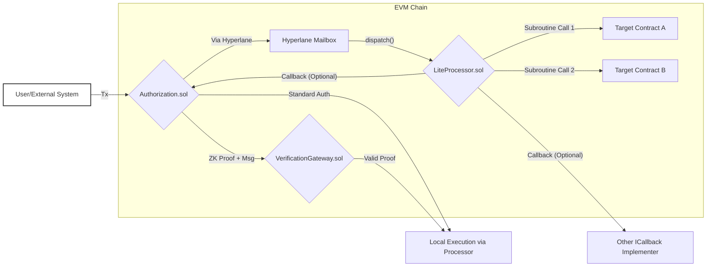

# EVM Authorization and Processor Architecture

This document outlines the architecture of the Valence Protocol's Authorization and Processor contracts specifically for EVM-compatible chains. These contracts are responsible for managing permissions and executing subroutines (sequences of function calls) on the EVM.

## Overview

The EVM deployment of Valence utilizes a pair of core contracts: `Authorization.sol` and an implementation of `ProcessorBase.sol` (typically `LiteProcessor.sol`). These contracts work together to provide a secure and controlled environment for executing DeFi operations.

## Core Contracts

### `Authorization.sol` (EVM)

The `Authorization.sol` contract acts as the primary control plane on the EVM chain. Its key responsibilities revolve around *permission management*, *execution dispatch*, *callback handling*, and *admin functions*. 

For permission management, it handles standard authorizations by maintaining a mapping (`authorizations`) that grants specific addresses permission to execute predefined function calls on target contracts via the Processor. It also supports ZK-proof based authorizations by integrating with a `VerificationGateway.sol` to enable authorizations based on successful ZK proof verification, maintaining a list of authorized ZK registries and associated user addresses (`zkAuthorizations`).

In terms of execution dispatch, for authorized standard requests, it can directly instruct the linked Processor. For ZK-based requests, it first verifies the proof via the `VerificationGateway` and, if valid, then instructs the Processor. It can also receive messages from a corresponding Authorization contract on a different chain (e.g., Neutron) via a cross-chain messaging solution like Hyperlane, which are then relayed to the EVM Processor.

As an `ICallback` implementer, it handles callbacks by receiving and processing results or data from the Processor after a subroutine execution, potentially storing callback data or emitting events. Finally, it provides owner-restricted admin functions to manage users, authorized contracts, ZK registries, and the linked Processor or `VerificationGateway` addresses.

### `ProcessorBase.sol` (Abstract Contract)

`ProcessorBase.sol` is an abstract contract defining the core interface and shared logic for EVM Processor contracts. It doesn't store messages or manage queues itself but provides the framework for executing *atomic* and *non-atomic subroutines*, handling pause/resume functionality, managing a set of `authorizedAddresses` that can directly submit execution messages, and sending callbacks to a designated `callbackReceiver` (typically `Authorization.sol`) after execution. These callbacks can also be sent via Hyperlane if the `authorizationContract` resides on a different domain.

### `LiteProcessor.sol` (EVM)

`LiteProcessor.sol` is a concrete, gas-optimized implementation of `ProcessorBase.sol`, designed for scenarios where message queuing on the EVM is not required, thus reducing gas overhead. It features *direct execution*, processing messages immediately upon receipt from an authorized source. This source can be the linked `Authorization.sol` contract (via Hyperlane through the `handle` function) or a directly `authorizedAddress` (via the `execute` function).

Its message handling capabilities primarily include processing `Pause` and `Resume` commands for the processor, and `SendMsgs` which decodes and executes the specified subroutine (atomic or non-atomic) contained within the message. A key characteristic is its *no queuing* nature; unlike potential CosmWasm counterparts or the more general `Processor.sol` (which is currently out of audit scope), `LiteProcessor.sol` does not implement message queues.

## Execution Flow

The execution of a subroutine within the EVM Valence system follows a general flow. 
Initiation can occur in several ways: an Externally Owned Account (EOA) or another contract might directly call `Authorization.sol` for standard or ZK-verified actions; a message might be relayed via Hyperlane from an Authorization contract on another chain to the EVM `Authorization.sol` and subsequently to `LiteProcessor.sol`; or a directly authorized address might call `LiteProcessor.sol`.

If the process is initiated via `Authorization.sol`, an Authorization Check is performed. For standard calls, `Authorization.sol` consults its `authorizations` mapping. For ZK calls, it invokes `VerificationGateway.sol` to verify the submitted ZK proof.

Following a successful authorization (or if initiated by a directly authorized address), the request is Dispatched to Processor. `Authorization.sol` (or the direct caller) invokes `LiteProcessor.sol`'s `execute` function (or `handle` if the message arrived via Hyperlane).

Next is Subroutine Execution, where `LiteProcessor.sol` decodes the message and executes the specified subroutine. If it's an *Atomic Subroutine*, all function calls within it must succeed; otherwise, the entire set of operations is reverted. For a *Non-Atomic Subroutine*, function calls are executed sequentially. Should one fail, subsequent calls in that subroutine are skipped, but previous successful calls remain committed.

Finally, an optional Callback can occur. After execution, `LiteProcessor.sol` may send a callback containing the execution result to the `callbackReceiver` specified in its configuration. This is usually the `Authorization.sol` contract or another entity implementing `ICallback`.

This architecture provides a flexible and secure way to manage and execute complex DeFi operations on EVM chains, leveraging both traditional access control and ZK-based permissions. 