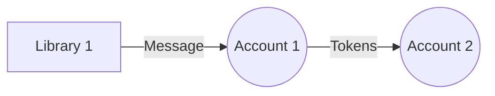
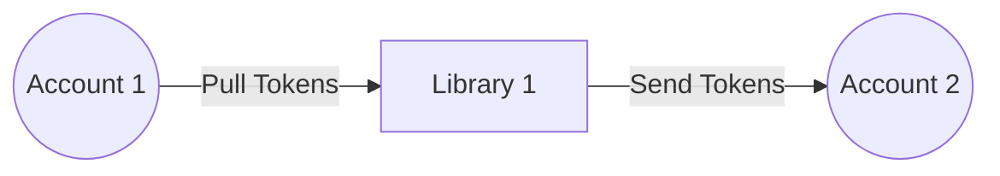

# Accounts and Libraries

- **Valence Account:** An escrow contract that can hold balances for various supported token-types (e.g., in Cosmos `ics-20` or `cw-20`) . Accounts register valence libraries that can perform token operations on the account.

- **Valence Libraries:** Valence libraries are registered with Valence accounts. Accounts are either registered as input accounts or output accounts. Libraries perform token operations on the input accounts, such as splitting, routing, or providing liquidity on a DEX, and depending on the business logic in the Library, they route the resulting tokens to the output accounts. Libraries expose _Functions_ that can be performed on them.

**Example**

In the following example, Library 1 is registered such that Account 1 is an input account and Account 2 is an output account. It can send a message to Account 1 which executes the message:

The following diagram represents the same relationships more intuitively, but is less technically accurate. Here, just as above, Library 1 is registered with Account 1. It takes the funds in Account 1 as an input, applies its logic, and sends the output funds to Account 2.

