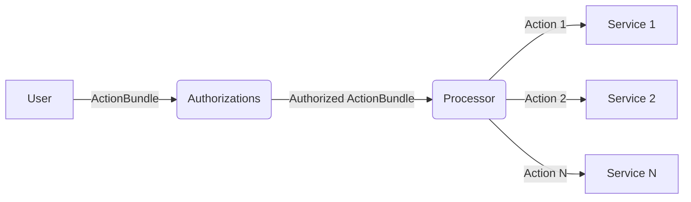

# Authorizations and Execution

- **Authorizations Module:** The Authorization module is the entry point for users. The user sends an _ActionsBundle_ to the Authorizations module. The Authorizations module then verifies that the sender is authorized and passes the bundle to the Processor for execution. The authority to execute any _ActionBundle_ is tokenized so that these tokens can be transferred on chain.

- **Processor:** The processor receives an _ActionBundle_ and executes the contained _Actions_ in sequence. It does this by maintaining an execution queue, where the queue items are _ActionBundles._ The processor exposes a `Tick` message that anyone that allows anyone to trigger the processor, whereby the first item of the queue is executed.

- **ActionBundle:** An ActionBundle is a vector of _Actions._ An Action is a message that can be executed on a _Service_. An _ActionBundle_ can contain _Actions_ across multiple _Services_ within the same _Domain_.

