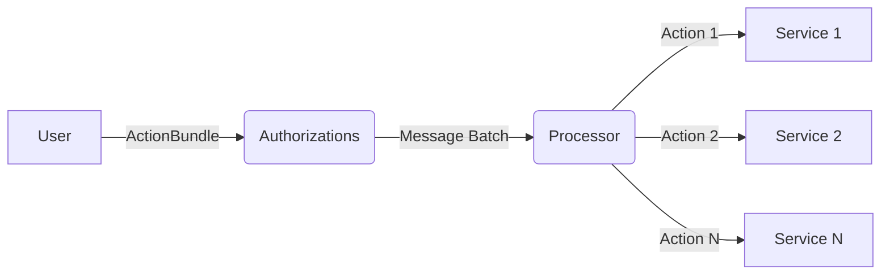

# Authorizations and Execution

Each Service exposes **`Actions`** to the Workflow. For example an IBC bridge service has the **`Transfer{..}`** action, which takes arguments including the amount and denom to transfer.

Workflows allow you to configure bundles of actions across multiple services and multiple chains. An **`ActionBundle`** can be:

- **Sequential**, i.e., execute action one, if it succeeds execute action two, and if that succeeds do action three, and so on.
- or **Atomic**, i.e., execution action one, action two, and action three, and if any of them fail then revert all steps. Atomic actions must be limited to one execution domain.

You have the ability to specify fine-grained controls over who initiates execution of an **`ActionBundle`** using the **`Authorizations`** module. For example, you can configure it so that:

- Anyone can initiate execution of an **`ActionBundle`**
- Only permissioned actors can initiate execution of an **`ActionBundle`**
- Execution can only be initiated after a starting date
- Authorizations are tokenized. Which means they can be transferred by the holder or used in more sophisticated DeFi
- Authorizations can expire
- Authorizations can be enabled/disabled
- Authorizations can tightly constrain parameters. For example, you want to authorize to execute a token transfer message but you want to limit them so they can only supply the amount argument and not the denom or receiver in the transfer message

**Authorizations Module:** The Authorization module is the entry point for users. The user sends a set of messages to the Authorizations module and the label (id) of the authorization he wants to execute. The Authorizations contracts then verifies that the sender is authorized, that the messages are valid, constructs a _MessageBatch_ and passes the batch to the Processor for execution. The authority to execute any _ActionBundle_ is tokenized so that these tokens can be transferred on chain.

**Processor:** The processor receives a _MessageBatch_ and executes the contained _Messages_ in sequence. It does this by maintaining execution queues, where the queue items are _ActionBundles._ The processor exposes a `Tick` message that allows anyone to trigger the processor, whereby the first item of the queue is executed or moved to the back of the queue if it's not executable yet (e.g. retry period has not passed).

**ActionBundle:** An ActionBundle is a vector of _Actions._ An Action is a message that can be executed on a _Service_. An _ActionBundle_ can contain _Actions_ across multiple _Services_ within the same _Domain_. When a user sends messages to the Authorization contract, they will be checked against the _ActionBundle_ and it will construct a _MessageBatch_ to forward to the corresponding Processor.

