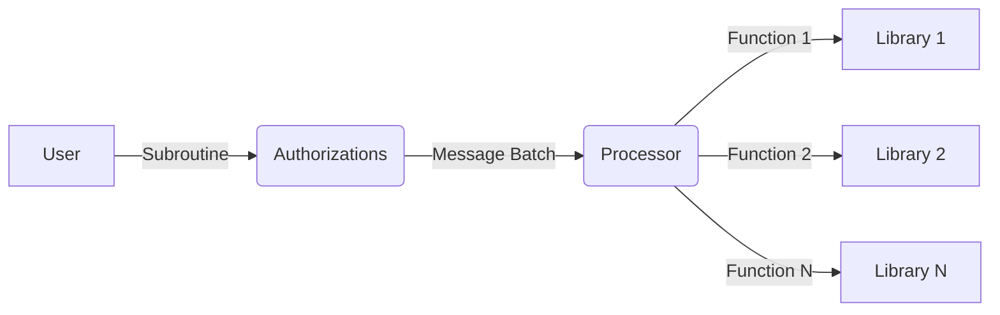

# Authorizations and Execution

Each Library exposes **`Functions`** to the Program. For example an IBC bridge library has the **`Transfer{..}`** function, which takes arguments including the amount and denom to transfer.

Programs allow you to configure subroutines of functions across multiple libraries and multiple chains. A **`Subroutine`** can be:

- **Sequential**, i.e., execute function one, if it succeeds execute function two, and if that succeeds do function three, and so on.
- or **Atomic**, i.e., execution function one, function two, and function three, and if any of them fail then revert all steps. Atomic functions must be limited to one execution domain.

You have the ability to specify fine-grained controls over who initiates execution of a **`Subroutine`** using the **`Authorizations`** module. For example, you can configure it so that:

- Anyone can initiate execution of a **`Subroutine`**
- Only permissioned actors can initiate execution of a **`Subroutine`**
- Execution can only be initiated after a starting timestamp/block height
- Execution can only be initiated up to a certain timestamp/block height
- Authorizations are tokenized. Which means they can be transferred by the holder or used in more sophisticated DeFi
- Authorizations can expire
- Authorizations can be enabled/disabled
- Authorizations can tightly constrain parameters. For example, you want to authorize to execute a token transfer message but you want to limit them so they can only supply the amount argument and not the denom or receiver in the transfer message

**Authorizations Contract:** The Authorization contract is the entry point for users. The user sends a set of messages to the Authorizations contract and the label (id) of the authorization he wants to execute. The Authorizations contract then verifies that the sender is authorized, that the messages are valid, constructs a _MessageBatch_ based on the subroutine and passes this batch to the Processor for execution. The authority to execute any _Subroutine_ is tokenized so that these tokens can be transferred on-chain.

**Processor:** The processor receives a _MessageBatch_ and executes the contained _Messages_ in sequence. It does this by maintaining execution queues, where the queue items are _Subroutines._ The processor exposes a `Tick` message that allows anyone to trigger the processor, whereby the first item of the queue is executed or moved to the back of the queue if it's not executable yet (e.g. retry period has not passed).

**Subroutine:** A Subroutine is a vector of _Functions._ A _Function_ is a message that can be executed on a _Library_. A _Subroutine_ can contain _Functions_ across multiple _Libraries_ within the same _Domain_. When a user sends messages to the Authorization contract, they will be checked against the _Subroutine_ and it will construct a _MessageBatch_ to forward to the corresponding Processor.

