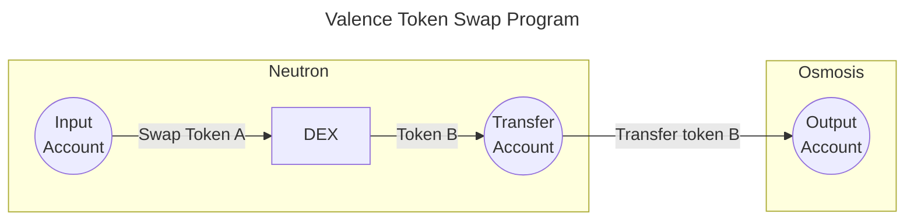

# Base Accounts

**Valence Programs** usually perform operations on tokens accross multiple domains. To ensure that the funds remain safe throughout a program's execution, Valence Programs rely on a primitive called **Valence Base Accounts**.

A **Valence Base Account** is an escrow contract that can hold balances for various supported token types (e.g., in Cosmos `ics-20` or `cw-20`) and ensure that only a restricted set of operations can be performed on the held tokens.
**Valence Base Accounts** are created (i.e., instantiated) on a specific **domain** and bound to a specific **Valence Program**. **Valence Programs** will typically use multiple accounts during the program's lifecycle for different purposes. **Valence Base Accounts** are generic by nature; their use in forming a program is entirely up to the program's creator.

Using a simple _token swap program_ as an example: the program receives an amount of **Token A** in an **input account** and will **swap** these **Token A** for **Token B** using a **DEX** on the **same domain** (e.g., Neutron). After the swap operation, the received amount of **Token B** will be temporarily held in a **transfer account** before being transfered to a final **output account** on another domain (e.g., Osmosis).

For this, the program will create the following accounts:
- A **Valence Base Account** is created on the **Neutron domain** to act as the **Input account**.
- A **Valence Base Account** is created on the **Neutron domain** to act as the **Transfer account**.
- A **Valence Base Account** is created on the **Osmosis domain** to act as the **Output account**.

Note: this is a simplified representation.

**Valence Base Accounts** do not perform any operation by themselves on the held funds, the operations are performed by **[Valence Libraries](./libraries_and_functions.md)**.
