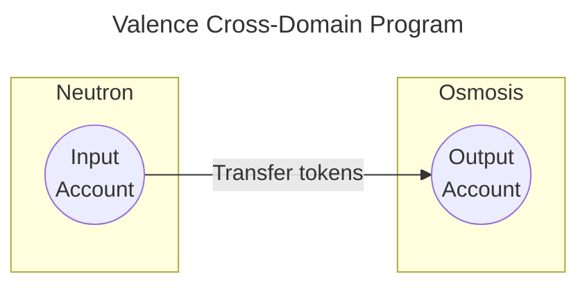

# Domains

A **Valence Program** is an instance of the **Valence Protocol**. A Valence Program's execution can typically _span multiple Blockchains_. In the Valence Protocol, we refer to the various blockchains that are supported as **domains**.

A **domain** is an environment in which the components that form a program (more on these later) can be instantiated (deployed).

**Domains** are defined by **three properties**:
  1. The **chain**: the blockchain's name _e.g. Neutron, Osmosis, Ethereum mainnet_.
  2. The **execution environment**: the environment under which programs (typically smart contracts) can be executed on that particular chain _e.g. CosmWasm, EVM, SVM_.
  3. The type of **bridge** used from the **main domain** to other domains _e.g. Polytone over IBC, Hyperlane_.

Within a particular ecosystem of blockchains (e.g. Cosmos), the Valence Protocol usually defines one specific domain as the **main domain**, on which some supporting infrastructure components are deployed. Think of it as the _home base_ supporting the execution and operations of Valence Programs. This will be further clarified in the [Authorizations & Processors](./authorizations_processors/_overview.md) section.

Below is a simplified representation of a _program transferring tokens_ from a given **input account** on the **Neutron domain**, a CosmWasm-enabled smart contract platform secured by the Cosmos Hub, to a specified **output account** on the **Osmosis domain**, a well-known DeFi platform in the Cosmos ecosystem. 

