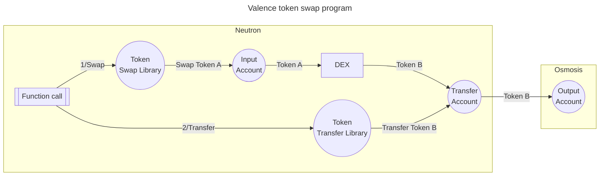

# Libraries and Functions

**Valence Libraries** contain the business logic that can be applied to the funds held by **Valence accounts**. Most often, this logic is about _performing operations on tokens_, such as splitting, routing, or providing liquidity on a DEX. A **Valence account** has to first approve (authorize) a **Valence library** for it to perform operations on that account's balances. **Valence Libraries** expose **Functions** that it supports. **Valence Programs** can be composed of a more or less complex graph of **Valence Accounts** and **Valence Libraries** to form a more or less sophisticated cross-chain workflow. During the course of a **Valence program**'s execution, **Functions** are called by external parties, and trigger the library's operations on the linked accounts.

A typical pattern for a **Valence Library** is to have one (or more) **input account(s)** and one (or more) **output account(s)**. While many libraries implement this pattern, it is by no means a requirement.

**Valence Libraries** play a critical role in integrating **Valence Programs** with existing decentralized apps and services that can be found in many Blockchain ecosystems e.g. DEXes, liquid staking, etc

Now that we know accounts cannot perform any operations by themselves, we need to revisit the _token swap program_ example (mentioned on the [Accounts](./accounts.md) page) and bring **Valence Libraries** into the picture: the program receives an amount of **Token A** in an **input account**, and a **Token Swap** library exposes a **swap** function that, when called, will perform a swap operation of **Token A** held by the **input account** for **Token B** using a **DEX** on the **same domain** (e.g. Neutron), and transfer them to the **transfer account**. A **Token Transfer** library, that exposes a **transfer** function, will transfer the **Token B** amount (when the function is called) to a final **output account** on another domain (e.g. Osmosis). In this scenario, the **DEX** is an existing service found on the hosting domain (e.g. **Astroport** on **Neutron**), so it is not part of the **Valence Protocol**.

The program is then composed of the following accounts & libraries:
- A **Valence Account** is created on the **Neutron domain** to act as the **Input account**.
- A **Valence Account** is created on the **Neutron domain** to act as the **Transfer account**.
- A **Token swap Valence Library** is created on the **Neutron domain**, _authorized_ by the **Input Account** (to be able to act on the held Token A balance), and _configured_ with the **Input account** and **Transfer account** as the respective input and output for the swap operation.
- A **Token Transfer Valence Library** is created on the **Neutron domain**, _authorized_ by the **Transfer Account** (to be able to act on the held Token B balance), and _configured_ with the **Transfer account** and **Output account** as the respective input and output for the swap operation.
- A **Valence Account** is created on the **Osmosis domain** to act as the **Output account**.

This example highlights the crucial role that **Valence Libraries** play for integrating **Valence Programs** with pre-existing decentralized apps and services.

One thing remains unclear in this example, though: how are **Functions** called? This is where [Authorizations and Execution](./authorizations_and_execution.md) come into the picture. 
