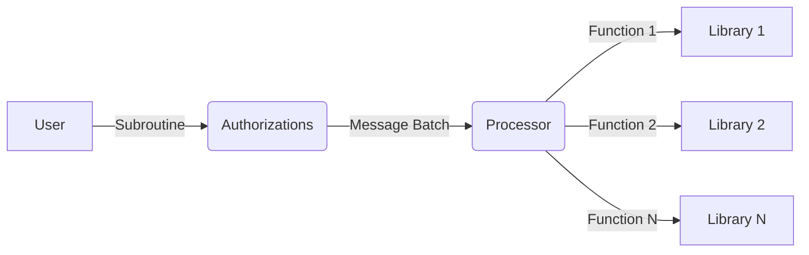

# Programs and Authorizations

A Valence program is an instance of the Valence protocol. It is a particular arrangement and configuration of [accounts](../accounts/_overview.md) and [libraries](./libraries_and_functions.md) across multiple [domains](./domains.md) (e.g., a POL lending relationship between two parties). Similarly to how a library exposes executable functions, programs are associated with a set of executable subroutines.

A subroutine is a vector of functions. A subroutine can call out to one or more functions from a single library, or from different libraries. A subroutine is limited to one execution domain (i.e., subroutines cannot use functions from libraries instantiated on multiple domains).

A subroutine can be:

- non‑atomic (e.g., execute function one; if that succeeds, execute function two; then three; and so on)
- atomic (e.g., execute function one, two, and three; if any fail, revert all steps)

Valence programs are typically used to implement complex cross‑chain workflows that perform financial operations in a trust‑minimized way. Because multiple parties may be involved in a program, the parties may wish for limitations on what various parties are authorized to do.

To specify fine‑grained controls over who can initiate the execution of a subroutine, program creators use the authorizations module.

The authorizations module supports access control configuration schemes such as:

| Authorization        | Description |
|----------------------|-------------|
| Open access          | Anyone can initiate execution of a subroutine. |
| Permissioned access  | Only permissioned actors can initiate execution of a subroutine. |
| Start time           | Execution can only be initiated after a starting timestamp or block height. |
| End time             | Execution can only be initiated up to a certain timestamp or block height. |
| Authorization model  | CosmWasm: TokenFactory tokens (factory/{authorization_contract}/{label}). EVM: address‑based per label with contract/function constraints (no tokenization). |
| Expiration           | Authorizations can expire. |
| Enable/disable       | Authorizations can be enabled or disabled. |
| Parameter constraints| Authorizations can constrain parameters (e.g., limit to amount only, not denom or receiver). |

To support on‑chain execution, the protocol provides two contracts: the Authorization contract and the Processor contract.

The Authorization contract is the entry point for users. The user sends a set of messages to the Authorization contract and the label (id) of the authorization they want to execute. The Authorization contract verifies the sender and the messages, constructs a message batch based on the subroutine, and passes this batch to the Processor for execution.
-  CosmWasm: permissioned workflows are enforced via TokenFactory‑minted per‑label tokens (burn/refund semantics with call limits).  
- EVM: permissioned workflows are enforced via per‑label address allowlists with function‑level constraints (contract address + selector/hash), no tokens are minted.

The Processor receives a message batch and executes the contained messages in sequence.
- CosmWasm: maintains High/Medium priority FIFO queues of subroutines and exposes a permissionless `tick` to process batches with retry/expiration handling.  
- EVM: the currently implemented Lite Processor executes immediately on receipt (no queues/insert/evict/retry), while a full queued Processor is scaffolded but not implemented.

