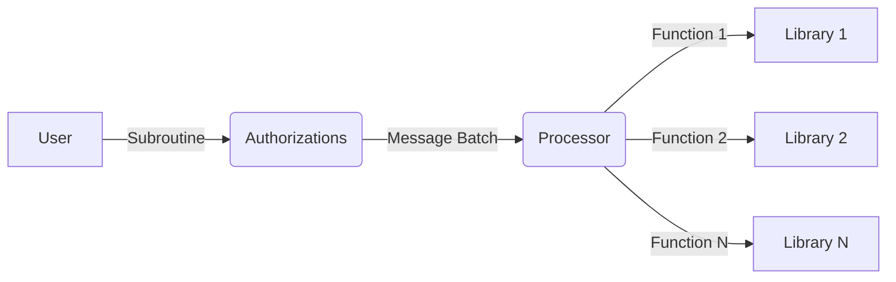

# Programs and Authorizations

A **Valence Program** is an instance of the **Valence Protocol**. It is a particular arrangement and configuration of [accounts](./accounts.md) and [libraries](./libraries_and_functions.md) across multiple [domains](./domains.md) e.g. a POL (protocol-owned liquidity) lending relationship between two parties. Similarly to how a _library_ exposes executable _functions_, programs are associated with a set of executable **Subroutines**.

A **Subroutine** is a vector of **Functions**. A **Subroutine** can call out to one or more **function(s)** (from a single library, or from different libraries), on one or more (execution) domain(s). 

A **Subroutine** can be:

- **Sequential**, i.e., execute function one, if it succeeds execute function two, and if that succeeds do function three, and so on.
- or **Atomic**, i.e., execution function one, function two, and function three, and if any of them fail then revert all steps. Atomic functions must be limited to one execution domain.

**Valence programs** are typically used to implement complex, cross-chain workflows performing financial operations, in a trust-minimized way, on funds provided by various third-parties. Therefore, it goes without saying that a program's subroutines should not (all and/or always) be allowed to be executed by just anout anyone.

To specify fine-grained controls over who can initiate the execution of a **Subroutine**, program creators use the **Authorizations** module.

The **Authorizations** module is a very powerful and flexible system that supports simple to more advanced access-control configuration schemes, such as:

- **Anyone** can initiate execution of a **Subroutine**
- Only **permissioned actors** can initiate execution of a **Subroutine**
- Execution can only be initiated **after a starting timestamp/block height**
- Execution can only be initiated **up to a certain timestamp/block height**
- Authorizations are **tokenized**, which means they can be transferred by the holder or used in more sophisticated DeFi scenarios
- Authorizations can **expire**
- Authorizations can be **enabled/disabled**
- Authorizations can tightly **constrain parameters**. For example, an authorization to execute a token transfer message can limit the execution to only supply the amount argument, and not the denom or receiver in the transfer message

To support the on-chain execution of **Valence Programs**, the **Valence Protocol** provides 2 important contracts: the **Authorizations contract** and the **Processor contract**.

The **Authorizations contract** is the entry point for users. The user sends a set of messages to the Authorizations contract and the label (id) of the authorization they want to execute. The Authorizations contract then verifies that the sender is authorized, that the messages are valid, constructs a _MessageBatch_ based on the subroutine and passes this batch to the **Processor contract** for execution. The authority to execute any _Subroutine_ is tokenized so that these tokens can be transferred on-chain.

The **Processor contract** receives a _MessageBatch_ and executes the contained _Messages_ in sequence. It does this by maintaining execution queues, where the queue items are _Subroutines._ The processor exposes a `Tick` message that allows anyone to trigger the processor, whereby the first batch of the queue is executed or moved to the back of the queue if it's not executable yet (e.g. retry period has not passed).

