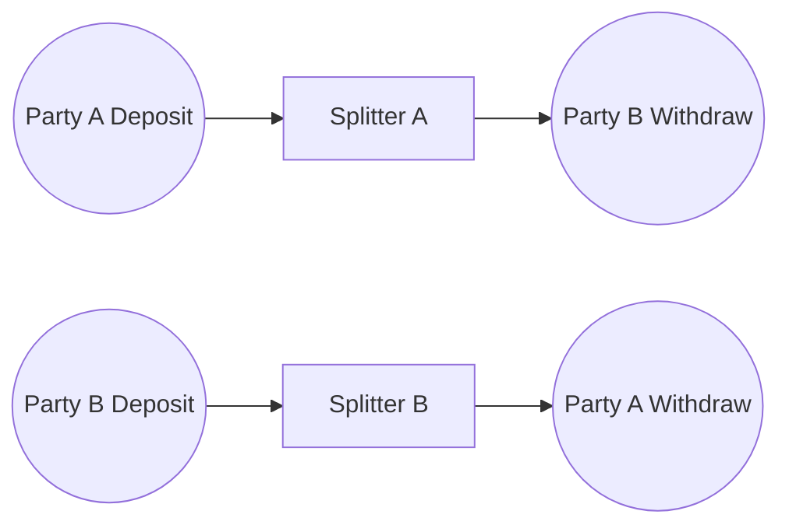

# Examples

Here are some examples of Valence Programs that you can use to get started.

## Token Swap Program

```mermaid
graph LR
	InA((Party A Deposit))
	InB((Party B Deposit))
	OutA((Party A Withdraw))
	OutB((Party B Withdraw))
	SSA[Splitter A]
	SSB[Splitter B]
	InA --> SSA --> OutB
	InB --> SSB --> OutA
```
