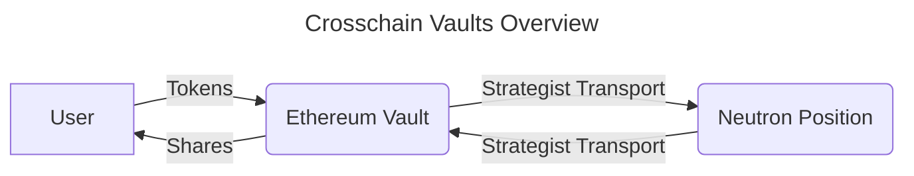
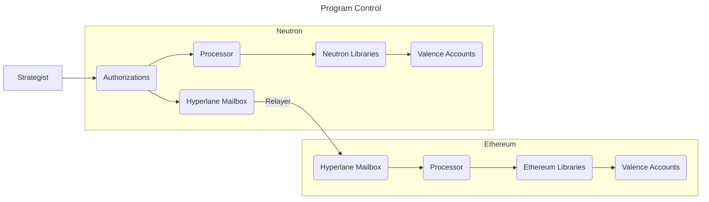
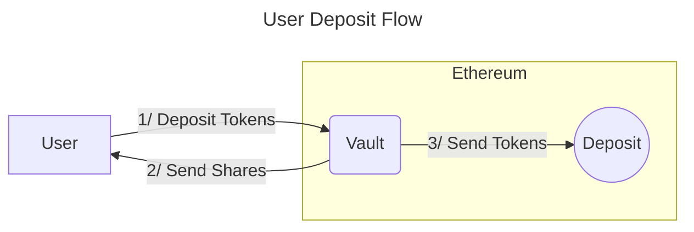
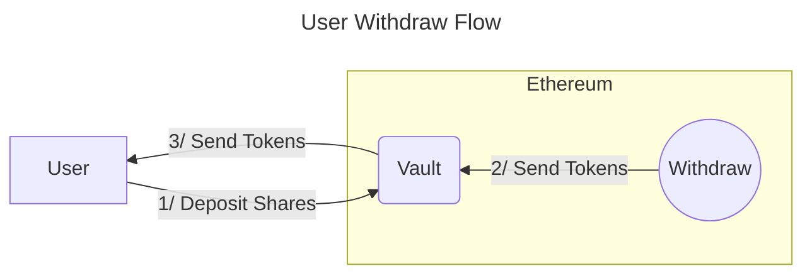
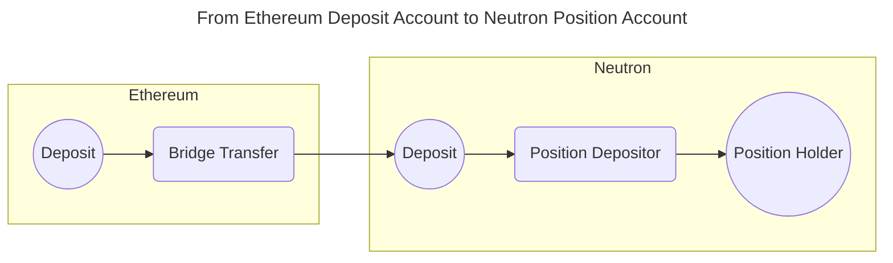
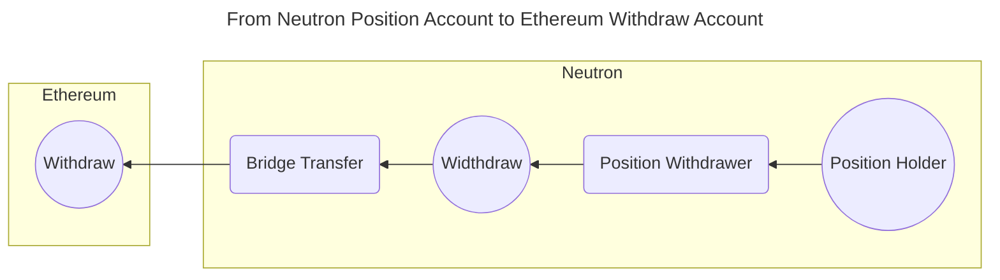
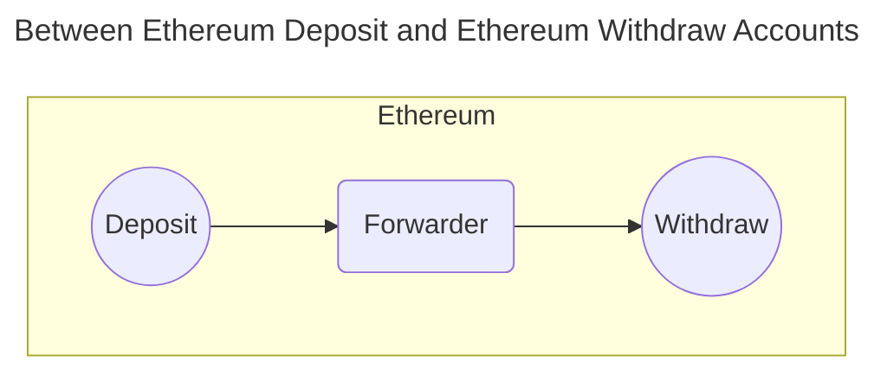

# Crosschain Vaults

**Note:** _This example is still in design and includes new or experimental features of Valence Programs that may not be supported in current production releases._

## Overview

You can use Valence Programs to create crosschain vaults. Users interact with a vault on one chain while the hokens are held on another chain where yield is generated.

In this example, we have made the following assumptions:
- Users can deposit tokens into a standard ERC4626 vault on Ethereum
- ERC20 shares are issued to users on Ethereum
- If a user wishes to redeem their tokens, they can issue a withdrawal request which will burn the user's shares when tokens are redeemed
- The redemption rate that tells us how many tokens can be redeemed per shares is given by: \\( R = \frac{TotalAssets}{TotalIssuedShares} = \frac{TotalInVault + TotalInTransit + TotalInPostion}{TotalIssuedShares}\\)
- A permissioned actor called the "Strategist" is authorized to transport funds from Ethereum to Neutron where they are locked in some DeFi protocol. And vice-versa, the Strategist can withdraw from the position so the funds are redeemable on Ethereum. The redemption rate must be adjusted by the Strategist accordingly

While we have chosen Ethereum and Neutron as examples here, one could similarly construct such vaults between any two chains as long as they are supported by Valence Programs.

## Implementing Crosschain Vaults as a Valence Program

Recall that Valence Programs are comprised of Libraries and Accounts. Libraries are a collection of Functions that perform token oprations on the Accounts. Since there are two chains here, Libraries and Accounts will exist on both chains.

Since gas is cheaper on Neutron than on Ethereum, computationally expensive operations, such as constraining the Strategist actions will be done on Neutron. Authorized messages will then be executed by each chain's Processor. Hyperlane is used to pass messages from the Authorization contract on Neutron to the Processor on Ethereum.

### Libraries and Accounts needed

On Ethereum, we'll need Accounts for:
- **Deposit**: To hold user deposited tokens. Tokens from this pool can be then transported to Neutron.
- **Withdraw**: Told hold tokens received from Neutron. Tokens from this pool can then be 

On Neutron, we'll need Accounts for:
- **Deposit**: To hold tokens bridged from Ethereum. Tokens from this pool can be used to enter into the position on Neutron.
- **Position Holder**: Will hold the vouchers or shares associated with the position on Neutron
- **Withdraw**: To hold the tokens that are withdrawn from the position. Tokens from this pool can be bridged back to Ethereum.

We'll need the following Libraries on Ethereum:

We'll need the following Libraries on Neutron:

The Vault contract is a special contract on Ethereum that does the following:

#### Allowing users to deposit and withdraw tokens

#### Allowing the Strategist to transport funds

