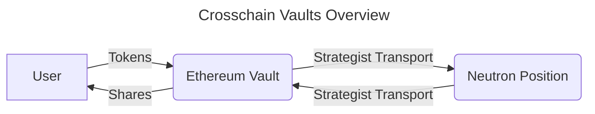
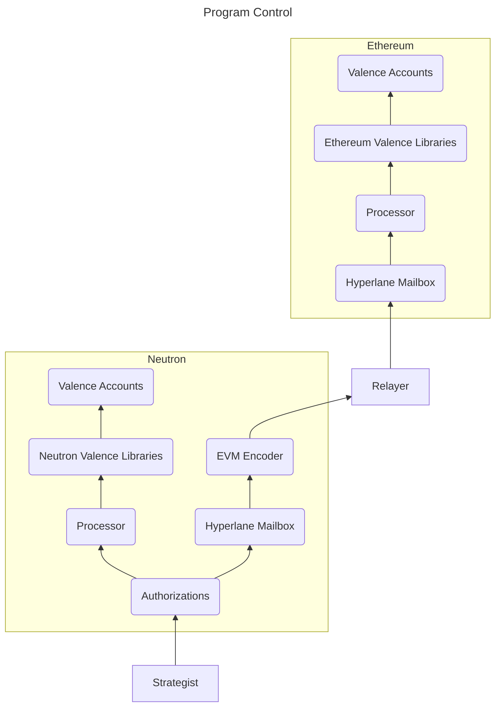
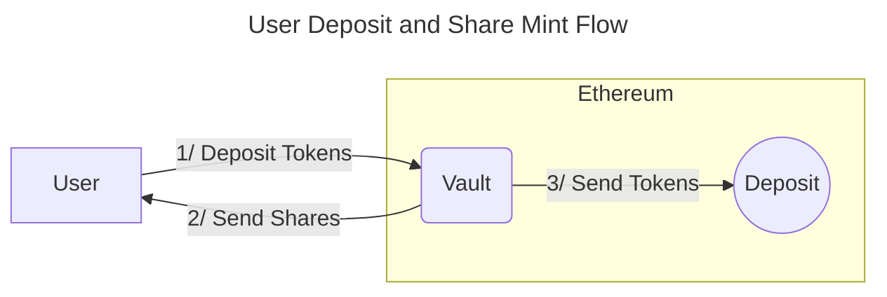
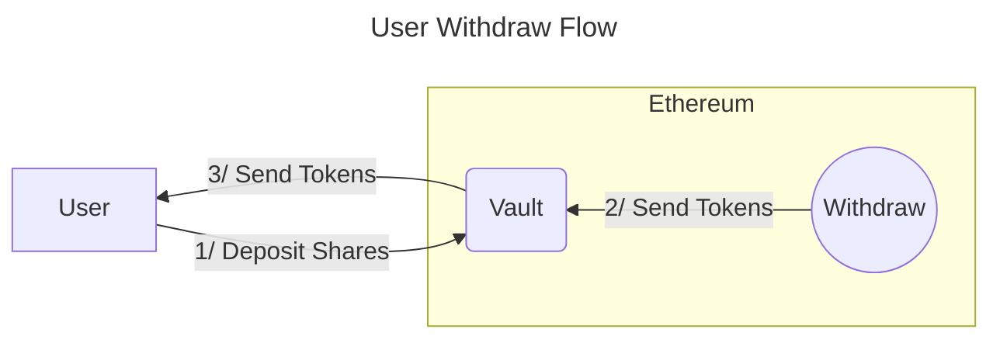
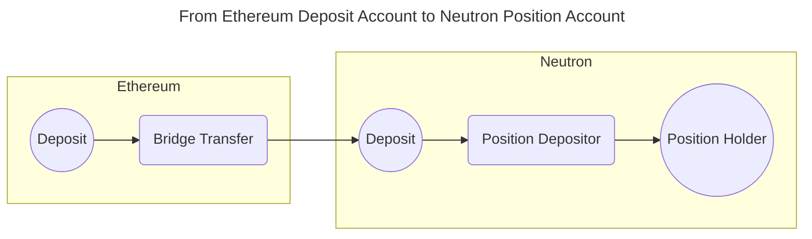
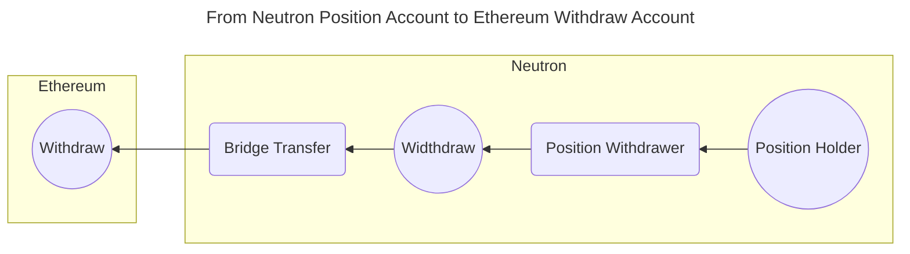
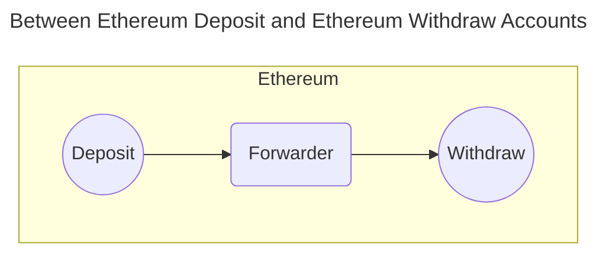

# Crosschain Vaults

**Note:** _This example is still in the design phase and includes new or experimental features of Valence Programs that may not be supported in the current production release._

## Overview

You can use Valence Programs to create crosschain vaults. Users interact with a vault on one chain while the tokens are held on another chain where yield is generated.

In this example, we have made the following assumptions:
- Users can deposit tokens into a standard ERC4626 vault on Ethereum
- ERC20 shares are issued to users on Ethereum
- If a user wishes to redeem their tokens, they can issue a withdrawal request which will burn the user's shares when tokens are redeemed
- The redemption rate that tells us how many tokens can be redeemed per shares is given by: \\( R = \frac{TotalAssets}{TotalIssuedShares} = \frac{TotalInVault + TotalInTransit + TotalInPostion}{TotalIssuedShares}\\)
- A permissioned actor called the "Strategist" is authorized to transport funds from Ethereum to Neutron where they are locked in some DeFi protocol. And vice-versa, the Strategist can withdraw from the position so the funds are redeemable on Ethereum. The redemption rate must be adjusted by the Strategist accordingly



While we have chosen Ethereum and Neutron as examples here, one could similarly construct such vaults between any two chains as long as they are supported by Valence Programs.

## Implementing Crosschain Vaults as a Valence Program

Recall that Valence Programs are comprised of Libraries and Accounts. Libraries are a collection of Functions that perform token oprations on the Accounts. Since there are two chains here, Libraries and Accounts will exist on both chains.

Since gas is cheaper on Neutron than on Ethereum, computationally expensive operations, such as constraining the Strategist actions will be done on Neutron. Authorized messages will then be executed by each chain's Processor. Hyperlane is used to pass messages from the Authorization contract on Neutron to the Processor on Ethereum.



### Libraries and Accounts needed

On Ethereum, we'll need Accounts for:
- **Deposit**: To hold user deposited tokens. Tokens from this pool can be then transported to Neutron.
- **Withdraw**: Told hold tokens received from Neutron. Tokens from this pool can then be 

On Neutron, we'll need Accounts for:
- **Deposit**: To hold tokens bridged from Ethereum. Tokens from this pool can be used to enter into the position on Neutron.
- **Position**: Will hold the vouchers or shares associated with the position on Neutron
- **Withdraw**: To hold the tokens that are withdrawn from the position. Tokens from this pool can be bridged back to Ethereum.

We'll need the following Libraries on Ethereum:
- **Bridge Transfer**: To transfer funds from the Etherem Deposit Account to the Neutron Deposit Account. 
- **Forwarder**: To transfer funds between the Deposit and Withdraw accounts on Ethereum. Two instances of the Library will be required.

We'll need the following Libraries on Neutron:
- **Position Depositor**: To take funds in the Deposit and create a position with them. The position is helf by the Position account.
- **Position Withdrawer**: To redeem a position for underlying funds that are then transferred to the withdraw account.
- **Bridge Transfer**: To transfer funds from the Neutron Withdraw Account to the Ethereum Withdraw Account.

### Vault Contract
The Vault contract is a special contract on Ethereum that has an ERC4626 interface.

#### User methods to deposit funds
- **Deposit**: Deposit funds into the registered Deposit Account. Receive shares back based on the redemption rate. 
	```
	Deposit {
		amount: Uint256,
		receiver: String
	}
	```
- **Mint**: Mint shares from the vault. Expects the user to provide sufficient tokens to cover the cost of the shares based on the current redemption rate.
	```
	Mint {
		shares: Uint256,
		receiver: String
	}
	```


#### User methods to withdraw funds
- **Redeem**: Send shares to redeem assets. This creates a `WithdrawRecord` in a queue. This record is processed at the next `Epoch`
	```
	Redeem {
		shares: Uint256,
		receiver: String,
		max_loss_bps: u64
	}
	```
- **Withdraw**: Withdraw amount of assets. It expects the the user to have sufficient shares. This creates a `WithdrawRecord` in a queue. This record is processed at the next `Epoch`
	```
	Withdraw {
		amount: Uint256,
		receiver: String,
		max_loss_bps: u64
	}
	```

Withdraws are subject to a lockup period after the user has initiated a redemption. During this time the redemption rate may change. Users can specify an acceptable loss in case the the redemption rate decreases using the `max_loss_bps` parameter.

After the `Epoch` has completed, a user may complete the withdrawal by executing the following message:

- **CompleteWithdraw**: Pop the `WithdrawRecord`. Pull funds from the Withdraw Account and send to user. Burn the user's deposited shares.



### Strategist methods to manage the vault
The vault validates that the Processor is making calls to it. On Neutron, the Authorization contract limits the calls to be made only by a trusted Strategist. The Authorization contract can further constrain when/how the Strategist actions can be taken.

- **Update**: The strategist can update the current redemption rate. 
  ```
  Update {
	rate: Uint256
  }
- **Pause and Unpause**: The strategist can pause and unpause vault operations.
  ```
  Pause {}
  ```
### Program subroutines

The program authorizes the Strategist to update the redemption rate and transport funds between various accounts.

#### Allowing the Strategist to transport funds








## Design notes
This is a simplified design to demonstrate how a cross-chain vault may be implemented with Valence Programs. Production deployments will need to consider factors not covered here including:
- Fees for gas, bridging, and for entering/exiting the position on Neutron. It is recommend that the vault impose withdraw fee and platform for users.
- How to constrain the strategist behaviour to ensure to ensure that they are setting the redemption rates correctly