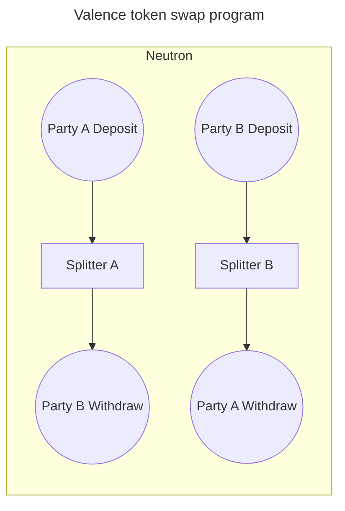

# Token Swap Program

This example demonstrates a simple _token swap_ program whereby two parties wish to exchange specific amounts of (different) tokens they each hold, at a rate they have previously agreed on. The program ensures the swap happens atomically, so neither party can withdraw without completing the trade.

The program is composed of the following components:

- **Party A Deposit account**: a [Valence Base account](../accounts/base_accounts.md) which Party A will deposit their tokens into, to be exchanged with Party B's tokens.
- **Splitter A**: an instance of the [Splitter library](../libraries/cosmwasm/splitter.md) that will transfer Party A's tokens from its input account (i.e. the **Party A Deposit account**) to its output account (i.e. the **Party B Withdraw account**) upon execution of its `split` function.
- **Party B Withdraw account**: the account from which Party B can withdraw Party A's tokens after the swap has successfully completed. Note: this can be a [Valence Base account](../accounts/base_accounts.md), but it could also be a regular chain account, or a smart contract.
- **Party B Deposit account**:  a [Valence Base account](../accounts/base_accounts.md) which Party B will deposit their funds into, to be exchanged with Party A's funds.
- **Splitter B**: an instance of the [Splitter library](../libraries/cosmwasm/splitter.md) that will transfer Party B's tokens from its input account (i.e. the **Party B Deposit account**) to its output account (i.e. the **Party A Withdraw account**) upon execution of its `split` function.
- **Party A Withdraw account**: the account from which Party A can withdraw Party B's tokens after the swap has successfully completed. Note: this can be a [Valence Base account](../accounts/base_accounts.md), but it could also be a regular chain account, or a smart contract.

The way the program is able to fulfil the requirement for an _atomic exchange of tokens_ between the two parties is done by implementing an **atomic subroutine** composed of two function calls:

1. **Splitter A**'s `split` function
2. **Splitter B**'s `split` function

The Authorizations component will ensure that either both succeed, or none is executed, thereby ensuring that **funds remain safe at all time** (either remaining in the respective deposit accounts, or transferred to the respective withdraw accounts).
