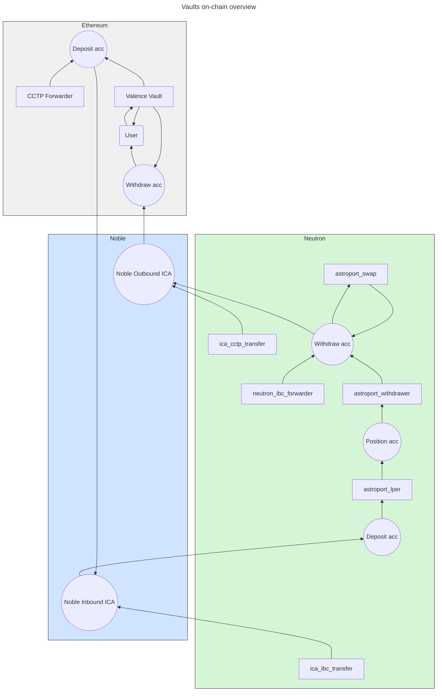

# Vault Strategist

**Note:** _The Strategist is still in the design phase and includes new or experimental features of Valence Protocol that may not be supported in the current production release._

## Overview

Vault Strategist is a type of off-chain solver that performs operations needed in order to keep the [Valence Vaults](./crosschain_vaults.md) functioning and up to date.

Strategist is meant to be run as an independent process, only interacting with the domains relevant for its operations via (g)RPC requests submitted to respective nodes.

A complete on-chain flow of a cross-chain Valence Vault — accepting deposits on Ethereum and entering a position on Neutron — might look as follows:

## Prerequisites

There are some prerequisites for a strategist to be able to carry out its entire order of operations.

These prerequisites will fit into the following broad categories:

- ability to submit (g)RPC requests to target domains
- instantiated smart contracts on both Neutron and Ethereum that authorize the strategist to execute their methods
- liveness of the transport protocol (CCTP) and the domains themselves

### Neutron Domain

Neutron side of the cross-chain vaults flow will involve a set of accounts and libraries authorizing the strategist to perform certain restricted actions.

**Smart Contracts**:

- *Noble ICA ibc transfer* - transferring funds from Noble inbound ICA to Neutron Deposit account
- *Astroport Liquidity provider* - entering into position
- *Astroport Withdrawer* - exiting from a position
- *Neutron IBC forwarder* - transferring funds from Neutron Withdraw account to Noble outbound ICA
- *Noble CCTP transfer* - CCTP transferring funds from Noble outbound ICA to Ethereum withdraw account

**Accounts**:

- *Noble Inbound Interchain Account*
- *Noble Outbound Interchain Account*
- *Deposit account*
- *Position account*
- *Withdraw account*

### Ethereum Domain

The Ethereum domain hosts the entry and exit point for user interaction. The strategist interacts with the vault and the CCTP forwarder to deposit or redeem tokens.

**Smart Contracts**:

- *CCTP Forwarder* - routing USDC from Ethereum to Noble
- *Valence Vault* - Vault based on ERC-4626

**Accounts**:

- *Deposit account* - holding funds due to be routed to Noble
- *Withdraw account* - holding funds due to be distributed to users who initiated a withdrawal

### Noble Domain

Noble acts as the intermediate bridging domain and handles both IBC and CCTP transfers.

Noble will host the inbound and outbound interchain accounts created by Valence Interchain Accounts deployed on Neutron.

**Inbound ICA** is meant for:
1. receiving tokens deposited from Ethereum via CCTP Forwarder
2. IBC Transferring those tokens from Noble to the Neutron deposit account

**Outbound ICA** is meant for:
1. receiving withdrawn tokens from Neutron withdraw account
2. routing those tokens from Noble to the Ethereum withdraw account by submitting a CCTP request

### Valence Domain Clients

The Strategist interacts with target domains by submitting (g)RPC requests.

These requests are constructed and submitted using [Valence Domain Clients](https://github.com/timewave-computer/valence-domain-clients), which support `async`/`await`, batched requests spanning an arbitrary number of domains, encoding schemes, and other domain-specific semantics in a standardized manner.

### CCTP Attestation Service

CCTP (Circle Cross-Chain Transfer Protocol) transfers require an attestation before assets can be minted on the destination chain.

Unfortunately the attestation service is closed-source and centralized. The only responsibility of the Strategist regarding it is to monitor its liveness, which is critical to Vault operation.

## Strategist Operations

The Strategist has a limited set of operations required to keep the Vault functioning properly.

There are various ways to orchestrate these operations. Some may be triggered by circuit breakers, event listeners, or other events.

To keep things simple, the following describes a basic strategy where actions are performed at fixed intervals (e.g., once per day):

### 1. Routing funds from Neutron to Ethereum

Routing funds back to the Vault chain would involve the following steps:

1. Neutron IBC Forwarder `transfer` call to IBC send the tokens from Neutron Withdraw account to Noble outbound ICA
2. Wait until the funds have arrived to the Noble outbound ICA
3. Noble CCTP transfer `transfer` call to CCTP transfer the tokens from Noble outbound ICA to the Ethereum withdraw account
4. Wait until the funds have arrived to the Ethereum withdraw account

### 2. Update the Vault state

Updating the Vault state is the most involved action that the strategist must take.

It involves three substeps and the final `update` call:

1. Calculating the *netting amount **N***
    1. Query the Ethereum Valence Vault for total amount due for withdrawal *S* (expressed in USDC)
    2. Query the Ethereum deposit account balance $d$
$$N = min(d, S)$$
2. Calculating the *redemption rate **R***
    1. Query the Ethereum Valence Vault for total shares issued (*s*)
    2. Query pending deposits in Neutron deposit account
    3. Simulate the shares liquidation into the deposit denom
  $$R = a / s$$
3. Calculating the *total fee **F***
    1. Query the Ethereum Valence Vault for the constant vault fee *F_c*
    2. Query the Neutron Astroport pool for the position fee *F_p*
  $$F = F_c + F_p$$
4. Ethereum Valence Vault update call: `update(R, P, S)`

### 3. Routing funds from Ethereum to Neutron

Routing funds from Ethereum to Neutron is performed as follows:

1. Ethereum CCTP transfer `transfer` call to CCTP transfer the tokens from Ethereum deposit account to Noble inbound ICA
2. Wait until the funds have arrived to the Noble inbound ICA
3. Noble ICA IBC transfer call to pull the funds from Noble inbound ICA to the Neutron Deposit account
4. Wait until the funds have arrived to the Neutron Deposit account

### 4. Enter the position on Neutron

Entering the position on Neutron is performed as follows:

1. Query Neutron Deposit account balance of the deposit token
2. Astroport Liquidity provider `provide_single_sided_liquidity` call to enter into the position

### 5. Exit the position on Neutron

Exiting the position on Neutron is performed as follows:

1. Astroport Liquidity withdrawer `withdraw_liquidity` call to trigger the liquidity withdrawal which will deposit the underlying tokens into the Withdraw account.
Note that this action may be subject to a lockup period!
2. Astroport Swapper `swap` call to swap the counterparty denom obtained from withdrawing the position into USDC
