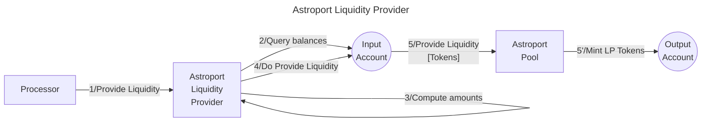

# Astroport LPer library

The **Valence Astroport LPer library** library allows to **provide liquidity** into an Astroport Liquidity Pool from an **input account** an deposit the LP token into an **output account**.

## High-level flow



## Configuration

The library is configured on instantiation via the `LibraryConfig` type.

```rust
pub struct LibraryConfig {
    // Account from which the funds are LPed
    pub input_addr: LibraryAccountType,
    // Account to which the LP tokens are forwarded
    pub output_addr: LibraryAccountType,
    // Pool address
    pub pool_addr: String,
    // LP configuration
    pub lp_config: LiquidityProviderConfig,
}

pub struct LiquidityProviderConfig {
    // Pool type, old Astroport pools use Cw20 lp tokens and new pools use native tokens, so we specify here what kind of token we are going to get.
    // We also provide the PairType structure of the right Astroport version that we are going to use for each scenario
    pub pool_type: PoolType,
    // Denoms of both native assets we are going to provide liquidity for
    pub asset_data: AssetData,
    // Slippage tolerance
    pub slippage_tolerance: Option<Decimal>,
}

#[cw_serde]
pub enum PoolType {
    NativeLpToken(valence_astroport_utils::astroport_native_lp_token::PairType),
    Cw20LpToken(valence_astroport_utils::astroport_cw20_lp_token::PairType),
}


pub struct AssetData {
    pub asset1: String,
    pub asset2: String,
}
```
