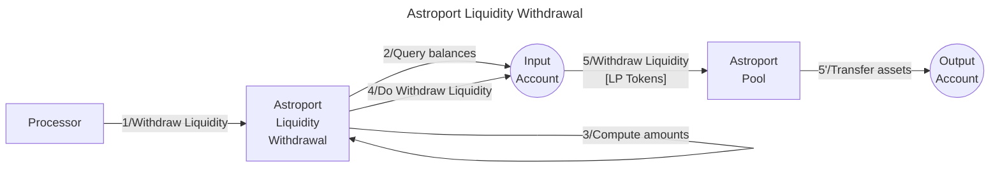

# Astroport Withdrawer library

The **Valence Astroport Withdrawer library** library allows to **withdraw liquidity** from an Astroport Liquidity Pool from an **input account** an deposit the withdrawed tokens into an **output account**.

## High-level flow



## Functions

| Function    | Parameters | Description |
|-------------|------------|-------------|
| **WithdrawLiquidity** | - |  Withdraw liquidity from the configured **Astroport Pool** from the **input account** and deposit the withdrawed tokens into the configured **output account** |

## Configuration

The library is configured on instantiation via the `LibraryConfig` type.

```rust
pub struct LibraryConfig {
    // Account holding the LP position
    pub input_addr: LibraryAccountType,
    // Account to which the withdrawn assets are forwarded
    pub output_addr: LibraryAccountType,
    // Pool address
    pub pool_addr: String,
    // Liquidity withdrawer configuration
    pub withdrawer_config: LiquidityWithdrawerConfig,
}

pub struct LiquidityWithdrawerConfig {
    // Pool type, old Astroport pools use Cw20 lp tokens and new pools use native tokens, so we specify here what kind of token we are will use.
    // We also provide the PairType structure of the right Astroport version that we are going to use for each scenario
    pub pool_type: PoolType,
}

pub enum PoolType {
    NativeLpToken,
    Cw20LpToken,
}
```
