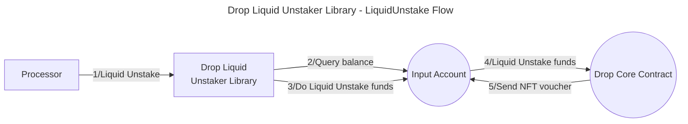
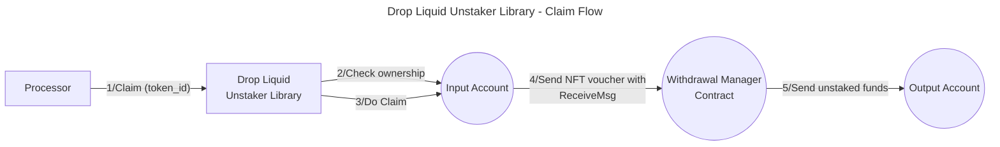

# Valence Drop Liquid Unstaker library

The **Valence Drop Liquid Unstaker** library allows to **liquid unstake** an asset from an **input account** from the [Drop protocol](https://docs.drop.money/) and to **withdraw** the claim once it's withdrawable and deposit the asset into the **output account**. It is typically used as part of a **Valence Program**. In that context, a **Processor** contract will be the main contract interacting with the Forwarder library.

## High-level flow





## Configuration

The library is configured on instantiation via the `LibraryConfig` type.

```rust
pub struct LibraryConfig {
    pub input_addr: LibraryAccountType,
    pub output_addr: LibraryAccountType,
    // Address of the liquid unstaker contract (drop core contract)
    pub liquid_unstaker_addr: String,
    // Address of the claimer contract (drop withdrawal manager)
    pub claimer_addr: String,
    // Address of the voucher NFT contract that we get after unstaking and we use for the claim
    pub voucher_addr: String,
    // Denom of the asset we are going to liquid unstake
    pub denom: String,
}
```
