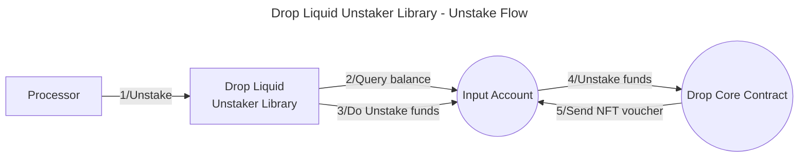
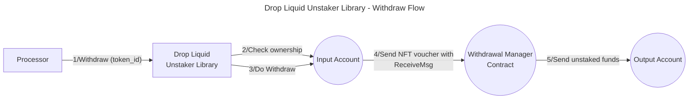

# Valence Drop Liquid Unstaker library

The **Valence Drop Liquid Unstaker** library allows liquid staked tokens (e.g., dNTRN or dATOM) to be redeemed for underlying assets (e.g., NTRN or ATOM) through the [Drop protocol](https://docs.drop.money/). The liquid staked asset must be available in the **input account**. When the library's function to redeem the staked assets (`LiquidUnstake`) is invoked, the library issues a withdraw request to the Drop protocol generating a tokenized voucher that is held by the input account. This tokenized voucher can be used to claim the underlying assets (represented as an NFT). Note that the underlying assets are not withdrawn immediately, as the Drop protocol unstakes assets asynchronously. At a later time, when the underlying assets are available for withdrawal, the library's claim function can be invoked with the voucher as an argument. This function will withdraw the underlying assets and deposit them into the **output account**.

## High-level flow





## Functions

| Function     | Parameters | Description                                                                                                                                 |
| ------------ | ---------- | ------------------------------------------------------------------------------------------------------------------------------------------- |
| **Unstake**  |            | Unstakes the balance of the **input account** from the **drop core contract** and deposits the **voucher** into the **input account**.      |
| **Withdraw** | token_id   | Withdraws the voucher with **token_id** identifier from the **input account** and deposits the unstaked assets into the **output account**. |

## Configuration

The library is configured on instantiation via the `LibraryConfig` type.

```rust
pub struct LibraryConfig {
    pub input_addr: LibraryAccountType,
    pub output_addr: LibraryAccountType,
    // Address of the liquid unstaker contract (drop core contract)
    pub liquid_unstaker_addr: String,
    // Address of the withdrawal_manager_addr (drop withdrawal manager)
    pub withdrawal_manager_addr: String,
    // Address of the voucher NFT contract that we get after unstaking and we use for the withdraw
    pub voucher_addr: String,
    // Denom of the asset we are going to unstake
    pub denom: String,
}
```
