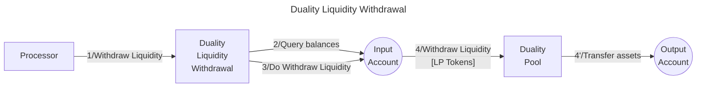

# Duality Withdrawer library

The **Valence Duality Withdrawer library** allows users to **withdraw liquidity** from a Duality Liquidity Pool from an **input account** and deposit the withdrawn tokens into an **output account**.

## High-level flow


| Function    | Parameters | Description |
|-------------|------------|-------------|
| **WithdrawLiquidity** | `amount: Option<Uint128>` |  Withdraw liquidity from the configured **Duality Pool** from the **input account**, and transfer the withdrawned tokens to the configured **output account**. If no amount is specified, the entire position is withdrawn.|

## Configuration

The library is configured on instantiation via the `LibraryConfig` type.

```rust
pub struct LibraryConfig {
    // Address of the input account 
    pub input_addr: LibraryAccountType,
    // Address of the output account 
    pub output_addr: LibraryAccountType,
    // Address of the pool we are going to withdraw liquidity from 
    pub pool_addr: String,
}
```

## Implementation Details

### Withdrawal Process

1. **Balance Check**: Queries the balance of the LP tokens in the input account. To withdraw liquidity, the wallet address must have a positive balance of LP tokens.
2. **Amount Calculation**: Uses the exact amount if specified; otherwise, withdraws the entire balance.
3. **Withdraw Liquidity**: Executes a `Withdraw` message, which withdraws the specified amount of liquidity to the Valence input account.
4. **Reply Handling**: Uses the CosmWasm reply mechanism to handle the two-step withdrawal process. Upon successful withdrawal, the withdrawn tokens are transferred to the Valence output account.

### Error Handling

- **No Funds**: Returns an error if attempting to withdraw with a zero balance of LP tokens.
- **Duality Integration**: Propagates errors from the Duality Protocol during withdrawal operations.
