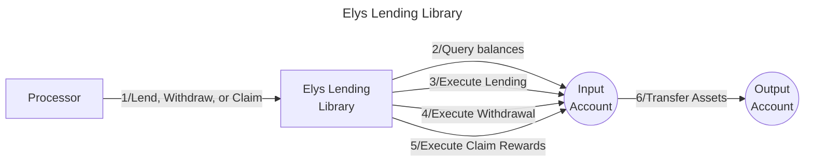

# Valence Elys Lending library

The Valence Elys Lending library facilitates lending operations through [Elys Earn Vaults](https://elys-network.gitbook.io/docs/core-features/earn/vaults) on the [Elys Protocol](https://app.elys.network/) from an input account and manages withdrawal of lent assets to an output account. Additionally, users can claim rewards earned from lending operations. This library enables Valence Programs to earn yield on deposited assets through Elys Protocol's lending markets while maintaining full control over the lending positions directly from the input account.

## High Level Flow



## Functions

| Function | Parameters | Description |
|----------|------------|-------------|
| **Lend** | - | Lends the entire balance of the vault token (determined by the pool ID) from the input account to the Elys Protocol. |
| **Withdraw** | `amount: Option<Uint128>` | Withdraws lent assets from the input account to the output account. If no amount is specified, the entire position is withdrawn. Rewards in vault tokens are automatically added to the balance upon withdrawal, while rewards in other denoms must be claimed separately. |
| **ClaimRewards** | - | Claims rewards earned from lending operations. Rewards include fees paid in USDC and bonus EDEN rewards, which are upon claiming transferred to the output account. |

## Configuration

The library is configured on instantiation via the `LibraryConfig` type.

```rust
pub struct LibraryConfig {
    /// Address of the input account
    pub input_addr: LibraryAccountType,
    /// Address of the output account
    pub output_addr: LibraryAccountType,
    /// ID of the pool we are going to lend to
    pub pool_id: Uint64,
}
```

## Implementation Details

### Lending Process

1. **Balance Check**: Queries the input account balance for the vault token, which is determined by the pool ID. The library queries the pool to retrieve the denom of the vault token.
2. **Lend**: Executes a `MsgBond` message to deposit assets into the vault. Borrowers use these assets to open Leverage LP positions, paying fees that are transformed into rewards for the lender.

### Withdrawal Process

1. **Balance Check**: Queries the locked (lent) token amount in the vault for the input account.
2. **Amount Calculation**: Uses the exact amount if specified; otherwise, withdraws the entire balance.
3. **Withdraw**: Executes a `MsgUnbond` message to withdraw the lent position back to the input account.
4. **Reply Handling**: Uses the CosmWasm reply mechanism to handle the two-step process of withdrawal. Upon successful withdrawal, the funds will be transferred to the Valence output account.

### Claim Rewards Process

1. **Claim**: Executes a `MsgClaimRewards` message to claim rewards earned from lending operations. Rewards include fees paid in USDC and bonus EDEN rewards, which are transferred to the input account. However, EDEN rewards are not transferable upon claiming. Instead, the input account will remain the owner of the EDEN tokens. Currently, the library does not implement functions for managing EDEN rewards, such as vesting or committing them.

2. **Reply Handling**: Uses the CosmWasm reply mechanism to send the transferable rewards (e.g., USDC) from the input Valence account to the output account. EDEN rewards are excluded from this transfer and remain in the input account.

#### Summary of EDEN Rewards

Claiming EDEN rewards does not make them immediately transferable. EDEN tokens function as vesting reward tokens within the Elys ecosystem, designed to encourage long-term participation. Users can commit EDEN back into the network to earn additional rewards or vest EDEN to convert them into transferable ELYS tokens over a 90-day linear vesting period. For more details, visit the [Elys Tokenomics and Rewards System Documentation](https://elys-network.gitbook.io/docs/tokenomic-and-rewards-system/eden-and-eden-boost).

### Error Handling

- **No Funds**: Returns an error if attempting to lend, withdraw, or claim rewards with a zero balance.
- **Elys Integration**: Propagates Elys Protocol errors during lending, withdrawal, or reward claim operations.

