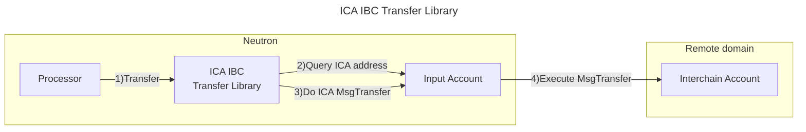

# Valence ICA IBC Transfer Library

The **Valence ICA IBC Transfer Library** library allows remotely executing an **IBC transfer** using a **Valence interchain account** on a remote IBC connected domain. It does that by remotely sending a **MsgTransfer** to the ICA created by the **Valence interchain account** on the remote domain. It is typically used as part of a **Valence Program**. In that context, a **Processor** contract will be the main contract interacting with the **Valence ICA IBC Transfer Library**.

## High-level flow



## Functions

| Function           | Parameters | Description                                                                                                                                                                                                                                                                                                                                                                                                                                           |
| ------------------ | ---------- | ----------------------------------------------------------------------------------------------------------------------------------------------------------------------------------------------------------------------------------------------------------------------------------------------------------------------------------------------------------------------------------------------------------------------------------------------------- |
| **Transfer**       | -          | Transfer funds using IBC from the ICA created by the **input_acount** to a **receiver** on a remote domain using the IBC **channel_id**                                                                                                                                                                                                                                                                                                               |
| **EurekaTransfer** | eureka_fee | Transfer funds over IBC from an **input account** on a source chain to an **output account** on a destination EVM chain using IBC Eureka. The eureka_fee parameter will contain the amount to be paid to a relayer address on the intermediate chain along with the timeout of this fee. All this information can be obtained from a Skip Go query explained in the IBC Eureka section below. **Important**: the fee timeout is passes in nanoseconds |

## Configuration

The library is configured on instantiation via the `LibraryConfig` type.

```rust
pub struct LibraryConfig {
    // Address of the input account (Valence interchain account)
    pub input_addr: LibraryAccountType,
    // Amount that is going to be transferred
    pub amount: Uint128,
    // Denom that is going to be transferred
    pub denom: String,
    // Receiver on the other chain
    pub receiver: String,
    // Memo to be passed in the IBC transfer message.
    pub memo: String,
    // Remote chain info
    pub remote_chain_info: RemoteChainInfo,
    // Denom map for the Packet-Forwarding Middleware, to perform a multi-hop transfer.
    pub denom_to_pfm_map: BTreeMap<String, PacketForwardMiddlewareConfig>,
    // Configuration used for IBC Eureka transfers
    pub eureka_config: Option<EurekaConfig>,
}

pub struct RemoteChainInfo {
    // Channel ID to be used
    pub channel_id: String,
    // Timeout for the IBC transfer in seconds. If not specified, a default 600 seconds will be used will be used
    pub ibc_transfer_timeout: Option<u64>,
}

// Configuration for a multi-hop transfer using the Packet Forwarding Middleware
struct PacketForwardMiddlewareConfig {
  // Channel ID from the source chain to the intermediate chain
  local_to_hop_chain_channel_id: String,
  // Channel ID from the intermediate to the destination chain
  hop_to_destination_chain_channel_id: String,
  // Temporary receiver address on the intermediate chain. Typically this is set to an invalid address so the entire transaction will revert if the forwarding fails. If not
  // provided it's set to "pfm"
  hop_chain_receiver_address: Option<String>,
}

// Configuration for IBC Eureka transfers
pub struct EurekaConfig {
    /// The address of the contract on intermediate chain that will receive the callback.
    pub callback_contract: String,
    /// The address of the contract on intermediate chain that will trigger the actions, in this case the Eureka transfer.
    pub action_contract: String,
    /// Recover address on intermediate chain in case the transfer fails
    pub recover_address: String,
    /// Source channel on the intermediate chain (e.g. "08-wasm-1369")
    pub source_channel: String,
    /// Optional memo for the Eureka transfer triggered by the contract. Not used right now but could eventually be used.
    pub memo: Option<String>,
    /// Timeout in seconds to be used for the Eureka transfer. For reference, Skip Go uses 12 hours (43200). If not passed we will use that default value
    pub timeout: Option<u64>,
}
```

### Packet-Forward Middleware

The library supports multi-hop IBC transfers using the Packet Forward Middleware (PFM).
This allows tokens to be transferred through an intermediate chain to reach their final
destination. More information about the PFM functionality can be found in the [official
documentation](https://github.com/cosmos/ibc-apps/tree/main/middleware/packet-forward-middleware).

This works in the same way as the **Generic IBC Transfer Library**. The only difference is that the **input account** is a **Valence interchain account** and the **receiver** is a remote address on the remote domain. For more details on how PFM works, check the [Generic IBC Transfer Library PFM](./generic_ibc_transfer.md#packet-forward-middleware) documentation.

### IBC Eureka

This library supports IBC Eureka transfers using an intermediate chain. This allows tokens to be transferred from the origin chain to EVM chains connected with IBC Eureka using standard IBC transfers together with Skip Go capabilities. For more information on how IBC Eureka works with Skip Go, please refer to this [Eureka overview](https://docs.skip.build/go/eureka/eureka-overview).

This works in the same way as the **Generic IBC Transfer Library**. The only difference is that the **input account** is a **Valence interchain account** and the **receiver** is a remote address on the remote EVM chain. For more details on how IBC Eureka works, check the [Generic IBC Transfer Library IBC Eureka](./generic_ibc_transfer.md#ibc-eureka) documentation.
