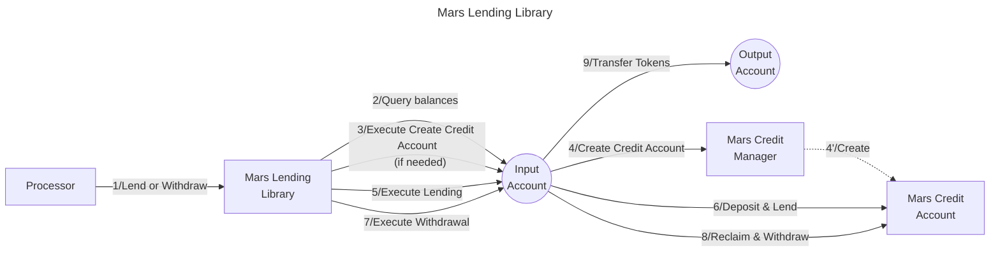

# Valence Mars Lending library

The Valence Mars Lending library facilitates lending operations on the [Mars Protocol](https://marsprotocol.io/) from an input account and manages withdrawal of lent assets to an output account. The library creates and manages a Mars credit account that is owned by the input account, enabling simple lending and withdrawal operations. This library enables Valence Programs to earn yield on deposited assets through Mars Protocol's lending markets while maintaining full control over the lending positions through Mars credit accounts.

## High-level Flow



## Functions

| Function | Parameters | Description |
|----------|------------|-------------|
| **Lend** | - | Creates a Mars credit account (if one doesn't exist) and lends the entire balance of the specified denom from the input account to the Mars Protocol through the credit account. |
| **Withdraw** | `amount: Option<Uint128>` | Withdraws lent assets from the Mars credit account to the output account. If no amount is specified, withdraws the entire position. |
| **Borrow** | `coin: Coin` | Borrows the specified amount of the given denom from Mars Protocol through the credit account. The borrowed tokens are sent to the output account specified in the library configuration. |
| **Repay** | `account_id: String`, `coin: Coin` | Repays borrowed assets to Mars Protocol through the input account. The `Coin` parameter contains `denom` and `amount` fields. |

## Configuration

The library is configured on instantiation via the `LibraryConfig` type.

```rust
pub struct LibraryConfig {
    // Address of the input account that will own the credit account
    pub input_addr: LibraryAccountType,
    /// Address of the output account that will receive withdrawn funds
    pub output_addr: LibraryAccountType,
    // Address of the Mars credit manager contract
    pub credit_manager_addr: String,
    // Denom of the asset we are going to lend
    pub denom: String,
}
```

## Implementation Details

### Credit Account Management

The library automatically handles Mars credit account lifecycle:

- **Account Creation**: When lending is first initiated, the library checks if a credit account exists for the input address. If not, it creates one through the Mars Credit Manager.
- **Account Ownership**: The credit account is owned by the input account, ensuring proper access control and security.
- **Single Account**: Each input account maintains exactly one credit account through this library.

### Lending Process

1. **Balance Check**: Queries the input account balance for the specified denom
2. **Credit Account Resolution**: Either uses existing credit account or creates a new one
3. **Deposit & Lend**: Deposits the tokens into the credit account and immediately lends them to Mars Protocol
4. **Reply Handling**: Uses CosmWasm reply mechanism to handle the two-step process of account creation followed by lending

### Withdrawal Process

1. **Credit Account Query**: Retrieves the existing credit account for the input address
2. **Amount Calculation**: Uses exact amount if specified, otherwise withdraws the entire balance
3. **Reclaim & Withdraw**: Executes two Mars actions:
   - `Reclaim`: Withdraws the lent position back to the credit account
   - `WithdrawToWallet`: Transfers the tokens from credit account to the output account

### Borrowing Process

1. **Credit Account Check**: Verifies the existence of a credit account for the input address
2. **Borrow Execution**: Executes the borrow action through the Mars credit account, which:
   - Borrows the specified amount of the given denom
   - Transfers the borrowed tokens to the output account specified in the library configuration
3. **Token Transfer**: The borrowed tokens are automatically transferred to the output account

### Repayment Process

1. **Credit Account Query**: Retrieves the existing credit account for the input address
2. **Token Transfer**: Transfers the repayment tokens from the input account to the credit account
3. **Repay Execution**: Executes the repay action through the Mars credit account

### Error Handling

- **No Funds**: Returns error if attempting to lend with zero balance
- **No Credit Account**: Returns error if attempting to withdraw without an existing credit account
- **Mars Integration**: Propagates Mars Protocol errors for lending/withdrawal operations

## Mars Protocol Integration

This library integrates with Mars Protocol's credit account system, which provides:

- **Isolated Lending**: Each credit account operates independently
- **Flexible Actions**: Support for multiple DeFi actions through a single account
- **Risk Management**: Mars Protocol's built-in risk management and liquidation mechanisms
- **Composability**: Credit accounts can be used for complex DeFi strategies beyond simple lending 

## Thanks

Thank you to Stana and the [Hydro](https://hydro.cosmos.network/) team for contributing this library upstream.