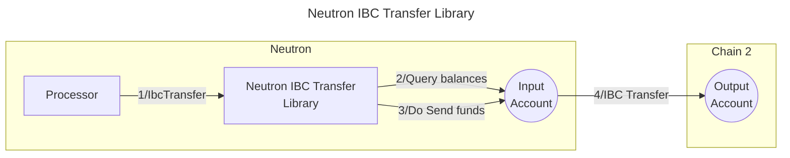

# Valence Neutron IBC Transfer library

The **Valence Neutron IBC Transfer** library allows to transfer funds over IBC from an **input account** on **Neutron** to an **output account** on a destination chain. It is typically used as part of a **Valence Program**. In that context, a **Processor** contract will be the main contract interacting with the Forwarder library.

Note: this library should not be used on another chain other than **Neutron**, which requires some NTRN fees to be paid to relayers for IBC transfers that the **input account** should hold. For other CosmWasm chains, use the **[Generic IBC Transfer library](./generic_ibc_transfer.md)** instead.

## High-level flow



## Functions

| Function           | Parameters | Description                                                                                                                                                                                                                                                                                                                                                                                                                                           |
| ------------------ | ---------- | ----------------------------------------------------------------------------------------------------------------------------------------------------------------------------------------------------------------------------------------------------------------------------------------------------------------------------------------------------------------------------------------------------------------------------------------------------- |
| **IbcTransfer**    | -          | Transfer funds over IBC from an **input account** on **Neutron** to an **output account** on a destination chain. The **input account** must hold enough NTRN balance to pay for the relayer fees                                                                                                                                                                                                                                                     |
| **EurekaTransfer** | eureka_fee | Transfer funds over IBC from an **input account** on a source chain to an **output account** on a destination EVM chain using IBC Eureka. The eureka_fee parameter will contain the amount to be paid to a relayer address on the intermediate chain along with the timeout of this fee. All this information can be obtained from a Skip Go query explained in the IBC Eureka section below. **Important**: the fee timeout is passes in nanoseconds |

## Configuration

The library is configured on instantiation via the `LibraryConfig` type.

```rust
struct LibraryConfig {
  // Account from which the funds are pulled (on the source chain)
  input_addr: LibraryAccountType,
  // Account to which the funds are sent (on the destination chain)
  output_addr: LibraryAccountType,
  // Denom of the token to transfer
  denom: UncheckedDenom,
  // Amount to be transferred, either a fixed amount or the whole available balance.
  amount: IbcTransferAmount,
  // Memo to be passed in the IBC transfer message.
  memo: String,
  // Information about the destination chain.
  remote_chain_info: RemoteChainInfo,
  // Denom map for the Packet-Forwarding Middleware, to perform a multi-hop transfer.
  denom_to_pfm_map: BTreeMap<String, PacketForwardMiddlewareConfig>,
  // Configuration used for IBC Eureka transfers
  eureka_config: Option<EurekaConfig>,
}

// Defines the amount to be transferred, either a fixed amount or the whole available balance.
enum IbcTransferAmount {
  // Transfer the full available balance of the input account.
  FullAmount,
  // Transfer the specified amount of tokens.
  FixedAmount(Uint128),
}

pub struct RemoteChainInfo {
  // Channel of the IBC connection to be used.
  channel_id: String,
  // Port of  the IBC connection to be used.
  port_id: Option<String>,
  // Timeout for the IBC transfer.
  ibc_transfer_timeout: Option<Uint64>,
}

// Configuration for a multi-hop transfer using the Packet Forwarding Middleware
struct PacketForwardMiddlewareConfig {
  // Channel ID from the source chain to the intermediate chain
  local_to_hop_chain_channel_id: String,
  // Channel ID from the intermediate to the destination chain
  hop_to_destination_chain_channel_id: String,
  // Temporary receiver address on the intermediate chain. Typically this is set to an invalid address so the entire transaction will revert if the forwarding fails. If not
  // provided it's set to "pfm"
  hop_chain_receiver_address: Option<String>,
}

// Configuration for IBC Eureka transfers
pub struct EurekaConfig {
    /// The address of the contract on intermediate chain that will receive the callback.
    pub callback_contract: String,
    /// The address of the contract on intermediate chain that will trigger the actions, in this case the Eureka transfer.
    pub action_contract: String,
    /// Recover address on intermediate chain in case the transfer fails
    pub recover_address: String,
    /// Source channel on the intermediate chain (e.g. "08-wasm-1369")
    pub source_channel: String,
    /// Optional memo for the Eureka transfer triggered by the contract. Not used right now but could eventually be used.
    pub memo: Option<String>,
    /// Timeout in seconds to be used for the Eureka transfer. For reference, Skip Go uses 12 hours (43200). If not passed we will use that default value
    pub timeout: Option<u64>,
}
```

### Packet-Forward Middleware

The library supports multi-hop IBC transfers using the Packet Forward Middleware (PFM).
This allows tokens to be transferred through an intermediate chain to reach their final
destination. More information about the PFM functionality can be found in the [official
documentation](https://github.com/cosmos/ibc-apps/tree/main/middleware/packet-forward-middleware).

Neutron IBC Transfer library can be configured to make use of PFM as follows:

- `output_addr` is set to the final receiver address on the final destination chain
- `remote_chain_info` is configured between the origin and intermediate chain
- `denom_to_pfm_map` is configured to map the origin denom to its respective
  `PacketForwardMiddlewareConfig` which should contain:

  - `local_to_hop_chain_channel_id` - origin to intermediate chain channel id
  - `hop_to_destination_chain_channel_id` - intermediate to destination chain channel id
  - `hop_chain_receiver_address` - address where funds should settle on the intermediate
    chain in case of a failure

> Official packet-forward-middleware recommends to configure intermediate chain settlement
> addresses (`hop_chain_receiver_address`) with an invalid bech32 string such as `"pfm"`.
> More information about this can be found in the [official documentation](https://github.com/cosmos/ibc-apps/tree/main/middleware/packet-forward-middleware#full-example---chain-forward-a-b-c-d-with-retry-on-timeout).

Consider an example configuration transferring tokens from Neutron to Gaia via Juno.
Library config may look like this:

```rust
let cfg = LibraryConfig {
    input_addr: input_acc,
    output_addr: output_acc,
    denom: UncheckedDenom::Native(target_denom),
    amount: IbcTransferAmount::FixedAmount(transfer_amount),
    memo: "".to_string(),
    remote_chain_info: RemoteChainInfo {
        channel_id: neutron_to_juno_channel_id,
        ibc_transfer_timeout: Some(500u64.into()),
    },
    denom_to_pfm_map: BTreeMap::from([(
        denom,
        PacketForwardMiddlewareConfig {
            local_to_hop_chain_channel_id: neutron_to_juno_channel_id,
            hop_to_destination_chain_channel_id: juno_to_gaia_channel_id,
            hop_chain_receiver_address: None, // if not passed, "pfm" is used
        },
    )]),
    eureka_config: None,
}
```

### IBC Eureka

This library supports IBC Eureka transfers using an intermediate chain. This allows tokens to be transferred from the origin chain to EVM chains connected with IBC Eureka using standard IBC transfers together with Skip Go capabilities. For more information on how IBC Eureka works with Skip Go, please refer to this [Eureka overview](https://docs.skip.build/go/eureka/eureka-overview).

This works in the same way as the **Generic IBC Transfer Library**. For more details on how IBC Eureka works, check the [Generic IBC Transfer Library IBC Eureka](./generic_ibc_transfer.md#ibc-eureka) documentation.
