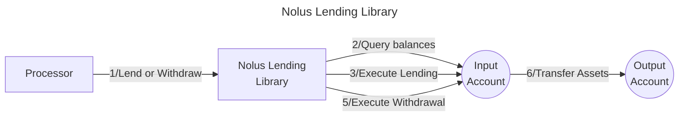

# Valence Nolus Lending library

The Valence Nolus Lending library facilitates lending operations on the [Nolus Protocol](https://nolus.io/) from an input account and manages withdrawal of lent assets to an output account. This library enables Valence Programs to earn yield on deposited assets through Nolus Protocol's lending markets while maintaining full control over the lending positions directly from the input account.

## High Level Flow



## Functions

| Function | Parameters | Description |
|----------|------------|-------------|
| **Lend** | - | Lends the entire balance of the specified denom from the input account to the Nolus Protocol. |
| **Withdraw** | `amount: Option<Uint128>` | Withdraws lent assets from the input account to the output account. If no amount is specified, the entire position is withdrawn. The user specifies the amount of nLPN tokens, which are received upon lending the assets. |

## Configuration

The library is configured on instantiation via the `LibraryConfig` type.

```rust
pub struct LibraryConfig {
    // Address of the input account
    pub input_addr: LibraryAccountType,
    /// Address of the output account
    pub output_addr: LibraryAccountType,
    // Address of the pool contract
    pub pool_addr: String,
    // Denom of the asset we are going to lend
    pub denom: String,
}
```

## Implementation Details

### Lending Process

1. **Balance Check**: Queries the input account balance for the specified denom.
2. **Lend**: There is a Liquidity Providers’ Pool (LPP) instance per denomination, serving all lenders that provide liquidity in that same currency. Upon deposits, lenders obtain an amount of CW20 interest-bearing token or nLPN. The entire amount of the specified denom will be lent to the Nolus Protocol.

### Withdrawal Process

1. **Balance Check**: Queries the balance of the nLPN. To withdraw LPN tokens, the wallet address needs to have a positive amount of nLPN tokens.
2. **Amount Calculation**: Uses the exact amount if specified; otherwise, withdraws the entire balance. If the user wishes to withdraw everything, the rewards will be claimed, and the user will no longer be a lender.
3. **Withdraw**: Executes a `Burn` message, which withdraws the lent position back to the input account.
4. **Reply Handling**: Uses the CosmWasm reply mechanism to handle the two-step process of withdrawal. Upon successful withdrawal, the funds will be transferred to the Valence output account.

### Error Handling

- **No Funds**: Returns an error if attempting to lend or withdraw with a zero balance.
- **Nolus Integration**: Propagates Nolus Protocol errors during lending or withdrawal operations.

