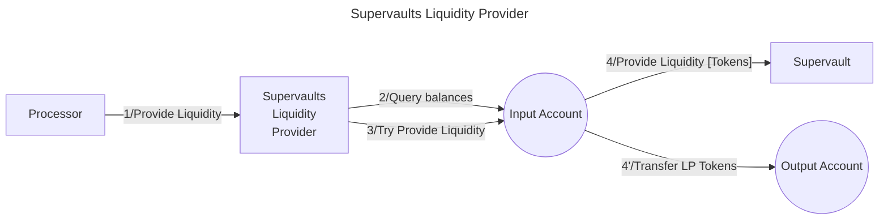

# Supervaults Liquidity Provider library

The **Valence Supervaults LPer library** library allows to **provide liquidity** into **Neutron Supervaults** from an **input account** and deposit the **LP tokens** into an **output account**.

## High-level flow



## Functions

| Function    | Parameters | Description |
|-------------|------------|-------------|
| **ProvideLiquidity** | `expected_vault_ratio_range: Option<PrecDecimalRange>` | Provide liquidity to the pre-configured **Supervault** from the **input account**, using available balances of both assets, and deposit the **LP tokens** into the **output account**. Abort if the vault price ratio is not within the `expected_vault_ratio_range` (if specified). |

## Configuration

The library is configured on instantiation via the `LibraryConfig` type.

```rust
pub struct LibraryConfig {
    // Account from which the funds are LPed
    pub input_addr: LibraryAccountType,
    // Account to which the LP tokens are forwarded
    pub output_addr: LibraryAccountType,
    // Supervault address
    pub vault_addr: String,
    // LP configuration
    pub lp_config: LiquidityProviderConfig,
}

pub struct LiquidityProviderConfig {
    // Denoms of both native assets we are going to provide liquidity for
    pub asset_data: AssetData,
    // LP token denom for the supervault
    pub lp_denom: String,
}

pub struct PrecDecimalRange {
    pub min: PrecDec,
    pub max: PrecDec,
}

pub struct AssetData {
    pub asset1: String,
    pub asset2: String,
}
```
