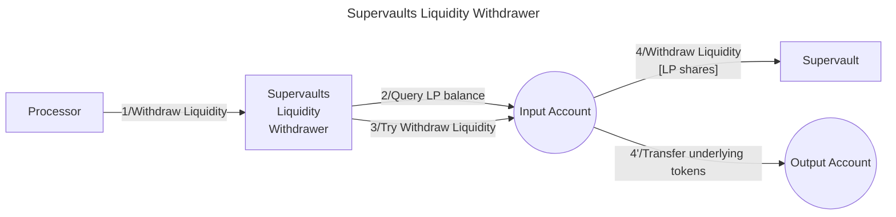

# Supervaults Liquidity Withdrawer library

The **Valence Supervaults Withdrawer library** library allows to **liquidate Supervault LP shares** via **Neutron Supervaults** from an **input account** and deposit the **resulting underlying assets** into an **output account**.

## High-level flow



## Functions

| Function    | Parameters | Description |
|-------------|------------|-------------|
| **WithdrawLiquidity** | `expected_vault_ratio_range: Option<PrecDecimalRange>` | Withdraw liquidity from the pre-configured **Supervault** from the **input account**, using available LP shares, and deposit the resulting **underlying assets** into the **output account**. Abort if the vault price ratio is not within the `expected_vault_ratio_range` (if specified). *Note*: `PrecDec` is a 27 decimal precision value.|

## Configuration

The library is configured on instantiation via the `LibraryConfig` type.

```rust
pub struct LibraryConfig {
    // Account from which the LP shares are liquidated
    pub input_addr: LibraryAccountType,
    // Account to which the resulting underlying tokens are forwarded
    pub output_addr: LibraryAccountType,
    // Supervault address
    pub vault_addr: String,
    // Liquidity withdrawal configuration
    pub lw_config: LiquidityWithdrawerConfig,
}

pub struct LiquidityWithdrawerConfig {
    // Denoms of both underlying native assets we are
    // expecting to receive upon withdrawal
    pub asset_data: AssetData,
    // LP token denom for the supervault
    pub lp_denom: String,
}

pub struct PrecDecimalRange {
    pub min: PrecDec,
    pub max: PrecDec,
}

pub struct AssetData {
    pub asset1: String,
    pub asset2: String,
}
```
