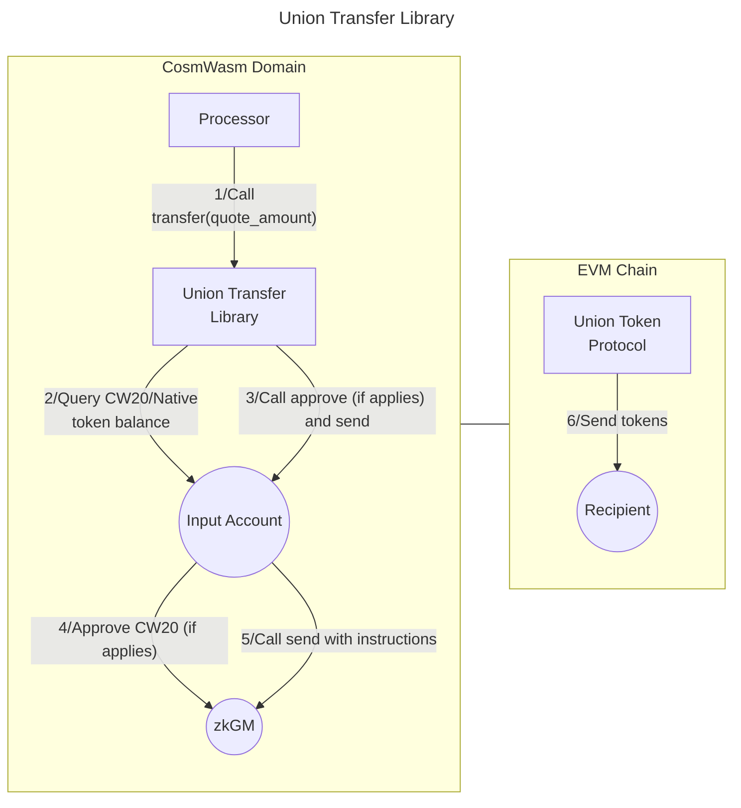

# Valence Union Transfer library

The **Valence Union Transfer** library allows to transfer funds over [Union](https://union.build/) from an **input account** on a source CosmWasm chain to an **output account** on a destination EVM chain using the [Union UCS03-ZKGM protocol](https://docs.union.build/ucs/03/), which allows arbitrary filling of orders by any party. It is typically used as part of a **Valence Program**. In that context, a **Processor** contract will be the main contract interacting with the Forwarder library.

## High-level flow



## Functions

| Function     | Parameters             | Description                                                                                                                                                                                                                              |
| ------------ | ---------------------- | ---------------------------------------------------------------------------------------------------------------------------------------------------------------------------------------------------------------------------------------- |
| **Transfer** | quote_amount(optional) | Transfer funds from the configured **input account** to the **output account** on the **destination chain**. The quote_amount parameter can override the configured quote token amount. If not passed, the amount in the config is used. |

## Configuration

The library is configured on instantiation via the `LibraryConfig` type. A list of supported chains and their channels can be found [here](https://docs.union.build/protocol/chains/overview/). Additional information of parameters used in the configuration can be found [here](https://docs.union.build/ucs/03/). This library allows any party to fill orders, therefore the `quote_amount` value should take into consideration the amount of tokens that the filling party will receive.

```rust
pub struct LibraryConfig {
    pub input_addr: LibraryAccountType,
    pub output_addr: LibraryAccountType,
    pub denom: UncheckedUnionDenomConfig,
    pub amount: TransferAmount,
    // Information about the asset to be transferred.
    pub input_asset_name: String,
    pub input_asset_symbol: String,
    pub input_asset_decimals: u8,
    pub input_asset_token_path: Uint256,
    // Information about the asset to be received.
    pub quote_token: String,
    pub quote_amount: Uint256,
    // Information about the remote chain.
    pub channel_id: u64,
    pub transfer_timeout: Option<u64>, // If not provided, a default 3 days will be used (259200 seconds).
    // Information about the protocol
    pub zkgm_contract: String, // The address of the ZKGM contract that we will interact with
    // They are using a batch operation with a transfer (FungibleAssetOrder) operation inside, so we need the version for both instructions.
    // If not provided, we will use the versions currently used by the protocol, but this is meant to be used for future upgrades.
    pub batch_instruction_version: Option<u8>, // The version of the batch instruction to be used. If not provided, the current default version will be used.
    pub transfer_instruction_version: Option<u8>, // The version of the transfer instruction to be used. If not provided, the current default version will be used.
}

pub enum UncheckedUnionDenomConfig {
    /// A native (bank module) asset.
    Native(String),
    /// A cw20 asset along with the token minter address that needs to be approved for spending during transfers.
    Cw20(UncheckedUnionCw20Config),
}

pub struct UncheckedUnionCw20Config {
    pub token: String,
    pub minter: String,
}

pub enum TransferAmount {
    FullAmount,
    FixedAmount(Uint128),
}
```
