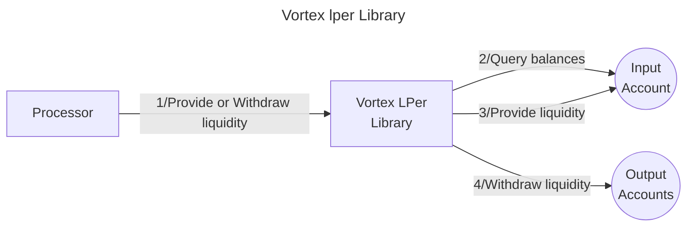

# Vortex LPer library

The **Valence Vortex LPer library** allows users to **deposit** into an Osmosis pool via Vortex contract from an **input account**. Also, the library allows **withdrawing from position** via vortex contract and receiving the withdrawn tokens into an **output account** and **output account_2** (principal and counterparty tokens).

## High Level Flow



## Functions

| Function | Parameters | Description |
|----------|------------|-------------|
| **ProvideLiquidity** | `tick_range: TickRange`<br>`token_min_amount_0: Uint128`<br>`token_min_amount_1: Uint128` | tries to deposit the  entire principal and counterparty token amounts from the input account to the pool via Vortex. |
| **Withdraw** | - | withdraws all the liquidity from the position Vortex entered including potential rewards. |

## Configuration

The library is configured on instantiation via the `LibraryConfig` type.

```rust
pub struct LibraryConfig {
    /// Address of the input account 
    pub input_addr: LibraryAccountType,
    /// Address of the output account 
    pub output_addr: LibraryAccountType,
     /// Address of the second output account 
    pub output_addr_2: LibraryAccountType,
    /// Configuration for the liquidity provider
    /// This includes the pool address and asset data
    pub lp_config: LiquidityProviderConfig,
}

pub struct LiquidityProviderConfig {
    // Code of the vortex contract we are going to instantiate
    pub vortex_code: u64,
    // Label for the contract instantiation
    pub label: String,
    // Id of the pool we are going to provide liquidity for
    pub pool_id: u64,
    // Duration of the round in seconds
    pub round_duration: u64,
    // Duration of the auction in seconds
    pub auction_duration: u64,
    // Denoms of both assets we are going to provide liquidity for
    pub asset_data: AssetData,
    // Whether the principal token is first in the pool
    pub principal_first: bool,
}
```

## Implementation Details

### Providing Liquidity Process

1. **Balance Check**: Queries the input account balance for the specified pool assets.
2. **ProvideLiquidity**: Executes a `CreatePosition` message to the Vortex contract making Vortex to create a position in the Osmosis pool.

### Withdrawal Process

1. **Round End Check**: Queries the state of the Vortex contract to check if round ended - which must happen prior to executing a withdrawal.
2. **Position Check**: Checks if the position exists.
3. **Withdraw**: Executes a `EndRound` message on Vortex to withdraw the whole position.

